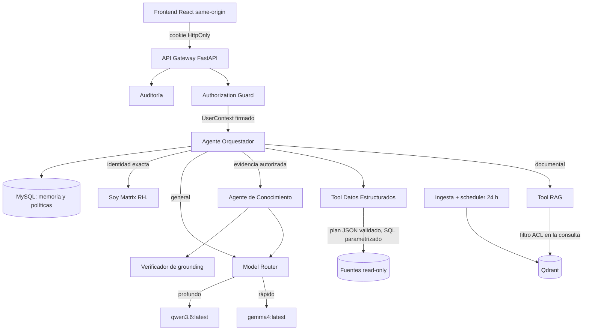

# Matrix RH

> Creado por Aldo Garcia.

Plataforma agéntica interna de Recursos Humanos: chat con RAG sobre documentación
corporativa, acceso controlado a bases de datos estructuradas, memoria
conversacional y autorización por rol. El perfil predeterminado ejecuta la IA
con Ollama local. Producción completamente local usa `AUTH_PROVIDER=oidc` con
un IdP interno. Entra ID y Vertex son integraciones cloud opcionales; Vertex
permanece bloqueado con `LLM_LOCAL_ONLY=true`.

> Versión del paquete: **1.2.3 — instalación auditada y preparación de modelos locales**.
> Continúa 1.2.2 (`1b2a9fe`), conservando GitHub `94fa083` y revisión 1.2.0 `472607f`
> en el historial. Mantiene estructura, lógica, AD inactivo y documentación.
> Consulte [validación de esta entrega](reports/LOCAL_MODEL_READINESS_1.2.3.md),
> [seguridad de instalación](reports/SUPPLY_CHAIN_1.2.3.md) y
> [preparación de los tres modelos](docs/LOCAL_MODEL_READINESS.md).
> El instalador integral Windows, AD, calidad con modelos reales y capacidad
> 200–250 requieren validación en el servidor destino.

---

## 1. Qué es y qué no es

**Es**: un backend FastAPI + un frontend React que responden preguntas de RH,
resumen archivos adjuntos y muestran las fuentes que sostienen cada afirmación.
La recuperación se limita a los documentos que el usuario autenticado tiene
autorizados.

**No es**: una vía para completar documentación oficial con conocimiento general
del modelo. Si la evidencia no alcanza, lo dice. Si el usuario no tiene acceso,
lo dice sin revelar qué existe.

La diferencia entre lo que ve un administrador y lo que ve un usuario restringido
proviene **exclusivamente del backend**. Ambos usan la misma interfaz; no hay
opciones ocultas por rol.

---

## 2. Requisitos previos

| Requisito | Versión | Comprobación |
|---|---|---|
| Windows 10/11 | — | — |
| **Python 3.12 x64** | 3.12.x | `py -3.12 --version` |
| **uv** | 0.12.8 x64 | `uv --version` |
| **Ollama** o runtime local compatible con los modelos seleccionados | — | preflight y [sonda](docs/MODEL_SMOKE_TEST.md) |
| MySQL o MariaDB | 5.7+ / 10.4+ | WAMP lo provee en `127.0.0.1:3306` |
| Node.js con Corepack (necesario para compilar el checkout fuente) | 22 LTS, 22.12+ | `node --version`, `corepack --version` |

Modelos predeterminados, sustituibles mediante `.env` (confirme digest y variante):

```bash
ollama pull gemma4:latest
```
```bash
ollama pull qwen3.6:latest
```
```bash
ollama pull embeddinggemma:latest
```

Qdrant se ejecuta por defecto en modo **embebido persistente** (`QDRANT_MODE=embedded`),
por lo que no hace falta Docker. Si dispone de una instancia Qdrant dedicada,
ponga `QDRANT_MODE=server` y `QDRANT_URL`.

---

## 3. Instalación e inicialización (una sola vez)

Doble clic en:

```
INSTALAR_MATRIX_RH.bat
```

`install.bat` es la entrada corta del instalador existente. Verifica Python y
uv → conserva o crea `.env` → recrea el venv si cambió de carpeta → sincroniza
`uv.lock` → comprueba los modelos y embeddings seleccionados en `.env` → verifica
MySQL y propiedad de la base → instala la UI con el npm fijado por Corepack y compila → aplica
migraciones → seed únicamente si está habilitado en desarrollo → preflight →
ingesta → arranque y comprobaciones `/health`, `/ready` e interfaz.

Antes de descargar dependencias frontend verifica el lock y, en modo online,
los avisos npm incluidos los de desarrollo. Después de `ci --ignore-scripts`
inspecciona el árbol instalado y sólo entonces permite compilar.

Parámetros: `-Offline` exige caches locales preparados; `-SkipFrontend` exige un
build existente validado; `-SkipIngest` omite ingesta explícitamente;
`-WithAutostart` registra el arranque al iniciar sesión. Ningún fallo de ingesta,
readiness o interfaz se presenta como instalación terminada.

Si prefiere la línea de comandos para instalar y arrancar:

```bash
install.bat
```

> **Base de datos.** Por defecto se usa `DATABASE_URL=mysql+pymysql://root:@127.0.0.1:3306/matrix_rh`.
> Si en su servidor ya existe una base con ese nombre, Matrix RH **no la usa**:
> el paso 6 del instalador elige el primer nombre libre (`matrix_rh_app`,
> `_app2`, …), lo escribe en `.env` y se lo dice. Su base queda intacta.
>
> Vale también para una base que exista pero esté **vacía**: Matrix RH sólo usa
> las bases que ha creado él. Si esa base es suya y quiere reutilizarla, póngalo
> por escrito con `MATRIX_ADOPT_EXISTING_DATABASE=true` en `.env`.

---

## 4. Arranque

Doble clic en:

```
INICIAR_MATRIX_RH.bat
```

Ejecuta el preflight, levanta el backend, espera a `/health` y `/ready`, sirve la
interfaz *same-origin* y abre el navegador en `http://127.0.0.1:8000`.

Para detenerlo:

```
DETENER_MATRIX_RH.bat
```

La guía corta de instalación, operación y diagnóstico está en
[`docs/OPERATOR_QUICKSTART.md`](docs/OPERATOR_QUICKSTART.md).

---

## 5. Usuarios de prueba

Mientras Microsoft Entra ID no esté conectado, Matrix RH usa un proveedor de
identidad local que **sólo funciona con `APP_ENV=development` o `test`**.

| Usuario | Contraseña | Rol | Acceso |
|---|---|---|---|
| `Matrix` | `Matrix RH` | `matrix_admin_test` | Categorías de negocio habilitadas para wildcard; no concede dominios restringidos nominales |
| `MatrixR1` | `Matrix RH` | `prestaciones_reader_test` | Únicamente `prestaciones` |

> ⚠️ **Estas son credenciales sintéticas conocidas de prueba, no secretos
> productivos.** Existen para validar el modelo de identidad y autorización antes
> de disponer de Entra ID. La contraseña **nunca** se guarda en claro: la base
> almacena exclusivamente un hash Argon2id. **Elimine o deshabilite estas cuentas
> antes de producción** — el arranque con `APP_ENV=production` ya falla si el
> proveedor local o el seed siguen habilitados.

---

## 6. Uso

1. Inicie sesión.
2. Para información de RH, pregunte en lenguaje natural: *"¿Cuántos días de
   vacaciones me corresponden con 5 años de antigüedad?"*. La respuesta se
   limita a documentación autorizada y muestra sus **fuentes**.
3. Para una consulta general fuera de RH, los modelos pueden explicar, idear o
   redactar con su conocimiento local. Esa ruta no se presenta como información
   interna y no fabrica citas corporativas.
4. Puede arrastrar un archivo (`.docx`, `.md`, `.pdf`, `.txt`, `.xlsx`, `.csv`) al
   chat. Espere a que aparezca como `indexed` y pida, por ejemplo, *«Resume el
   archivo adjunto y destaca sus puntos principales»*. El resumen muestra sus
   fuentes y se limita **sólo a esa conversación**: el adjunto no entra al corpus
   corporativo y nadie más puede verlo. Si hay varios adjuntos, el resumen cubre
   el contenido privado disponible en la conversación; use una conversación por
   archivo cuando necesite aislarlos.
5. «¿Quién eres?» responde exactamente «Soy Matrix RH.» sin depender de cuál de
   los dos modelos esté cargado.
6. Publicar conocimiento corporativo permanente requiere permiso administrativo
   y una categoría dentro del alcance efectivo del rol.

---

## 7. Añadir documentación corporativa

La documentación oficial se divide en ámbito general y repositorios
especializados:

```
data/knowledge/
├── general/
│   └── <tema>/
└── especializadas/
    └── <dominio>/
```

`general` corresponde al alcance base `HCM_EMP_BASICO_MX`. Cada dominio bajo
`especializadas` requiere su concesión `HCM_ADM_*` o `HCM_COORD_*`. Nómina
General y Nómina Confidencial se mantienen en dominios y grupos independientes.
Consulte la tabla exacta de rutas en
[`data/knowledge/README.md`](data/knowledge/README.md) y las reglas en
[`docs/DOCUMENTATION_GOVERNANCE.md`](docs/DOCUMENTATION_GOVERNANCE.md).

Las categorías **no son una lista cerrada**. Una carpeta nueva queda
**deny-by-default** y fuera del wildcard hasta que exista una regla explícita en
`config/authorization/categories.yaml` **y** una concesión de rol (que se
materializa con `scripts.load_entra_mapping`). **Ingerir un archivo no abre acceso
por sí solo:** si la categoría no está declarada y concedida, el modelo nunca la
recibe aunque esté indexada.

El procedimiento completo para un **dominio nuevo** (crear carpeta → declarar en
`categories.yaml` → conceder al rol → ingerir → verificar → probar) está en
[`docs/DOCUMENTATION_GOVERNANCE.md`](docs/DOCUMENTATION_GOVERNANCE.md),
sección «Publicar en un dominio nuevo».

Si tus archivos van a `general/`, no hay configuración extra. La reconciliación es
automática cada 24 h; para forzarla:

```bat
set "PYTHONPATH=%CD%\backend"
.venv\Scripts\python.exe -m scripts.bootstrap ingest
```

(ejecutar desde la raíz del proyecto; el instalador ya lo hace durante la primera
instalación).

---

## 8. Diagnóstico y validación

| Script | Qué hace | Modifica algo |
|---|---|---|
| `DIAGNOSTICO_MATRIX_RH.bat` | Revisa Python, venv, Ollama, modelos, embeddings, MySQL, Qdrant, frontend, backend, puertos, migraciones, usuarios de prueba, scheduler, Entra ID, conectores y logs | **No** |
| `windows\Validate-MatrixRH.ps1` | Preflight, migraciones, seed, ingesta, pruebas, seguridad, golden set del RAG, E2E, escenarios `Matrix`/`MatrixR1` y escaneo de secretos. Genera `reports/final-validation.json` | Sí (base de test) |

> La validación ya no tiene un `.bat` propio: se ejecuta directamente por
> PowerShell (misma lógica que antes).

Ejecución típica de la validación (con opciones útiles):

```bash
powershell -ExecutionPolicy Bypass -File windows\Validate-MatrixRH.ps1 -QuickRag -SkipE2E
```

El informe 1.1.0 es histórico y no certifica esta entrega. MySQL, Qdrant,
Ollama y el E2E visual deben validarse en el equipo Windows destino. No considere
la instalación aceptada hasta que `Validate-MatrixRH.ps1` termine con código 0 y
`reports/final-validation.json` no tenga gates críticos abiertos. Consulte el
estado honesto en [`docs/FINAL_AUDIT.md`](docs/FINAL_AUDIT.md).

### Fuentes estructuradas por perfil corporativo

Una consulta requiere simultáneamente `structured.query`, una concesión
`StructuredSourcePermission` y una fuente habilitada con DSN read-only:

| Rol HCM | Fuentes concedidas |
|---|---|
| `hcm_adm_ia_matrix` | `rh_demo`, `postgres_analytics` |
| `hcm_adm_admpersonal` | `sap_hcm`, `oracle_hcm` |
| `hcm_coord_*` y demás roles HCM | ninguna |

Las fuentes externas se distribuyen deshabilitadas o sin DSN: una concesión no
equivale a una conexión validada.

---

## 9. Arquitectura en una página



Detalle completo en [`docs/ARCHITECTURE.md`](docs/ARCHITECTURE.md).

---

## 10. Estructura del repositorio

```yaml
matrix-rh:
  backend:                         # FastAPI + Python 3.12 (gestionado con uv)
    app:                           # Código de la aplicación
      api:                         # Gateway HTTP
        routes:                    #   admin, auth, chat, conversations, health
        deps.py:                   #   inyección de dependencias
        middleware.py:             #   cabeceras de seguridad, contexto de request
        schemas.py:                #   contratos de entrada/salida
      auth:                        # Identidad y sesiones
        provider.py:               #   contrato de proveedor de identidad
        entra_provider.py:         #   Microsoft Entra ID / OIDC (preparado)
        oidc_provider.py:          #   SSO interno configurable, opcional
        local_provider.py:         #   proveedor local (sólo dev/test)
        passwords.py:              #   hashing Argon2id (nunca contraseñas en claro)
        sessions.py:               #   sesiones con cookie HttpOnly (patrón BFF);
                                   #   el token nunca llega al navegador
      authorization:              # RBAC aplicado ANTES de RAG/SQL/prompt
        categories.py:             #   alcance de categorías y wildcard (deny-by-default)
        context.py:                #   UserContext firmado (roles + concesiones)
        policy.py:                 #   evaluación de AuthorizationPolicy
        # Puertas: CategoryPermission (RAG), StructuredSourcePermission (SQL)
      agents:                      # Capa agéntica
        orchestrator.py:           #   enruta documental / estructurado / general
        query_planner.py:          #   plan de consulta
        knowledge_agent.py:        #   respuesta con evidencia autorizada
        prompts.py:                #   plantillas de prompt
      rag:                         # Recuperación aumentada
        chunking.py:               #   segmentación de documentos
        embedding_prompts.py:      #   prompts de embedding
        retriever.py:              #   recuperación con filtro ACL en la consulta
        grounding.py:              #   verificador de grounding / anti-alucinación
        vector_store.py:           #   integración con Qdrant
        index_manifest.py:         #   generaciones activas y huella de indexación
        schemas.py:                #   contratos del RAG
      structured_data:            # Acceso a datos estructurados read-only
        schemas.py:                #   plan de consulta (el LLM NO escribe SQL)
        validator.py:              #   valida el plan: allowlist de entidades y
                                   #   columnas por fuente + concesión de rol
        compiler.py:               #   plan validado -> SQL parametrizado (valores
                                   #   como bind params) + re-verificación por AST
        adapters.py:               #   ReadOnlySourceAdapter por motor:
                                   #   MySQL/MariaDB, PostgreSQL, SQL Server, Oracle
        sources.py:                #   catálogo; el DSN read-only vive en una env var,
                                   #   nunca se persiste ni se registra
        tool.py:                   #   herramienta expuesta al orquestador
      ingestion:                   # Ingesta de conocimiento
        loaders.py:                #   carga de .docx/.md/.pdf/.txt/.xlsx/.csv
        reconciler.py:             #   reconciliación del corpus
        service.py:                #   orquestación de ingesta
      llm:                         # Capa de modelos, perfil local por defecto
        model_policy.py:           #   router de los dos modelos
        ollama_client.py:          #   cliente Ollama
        provider.py:               #   interface/adapters y validación JSON Schema
      security:                    # Controles de seguridad transversales
        prompt_guard.py:           #   sanea texto no confiable (docs/mensajes) y
                                   #   neutraliza marcadores de prompt injection
        rate_limit.py:             #   rate limiting por ventana deslizante de 60 s
        upload_guard.py:           #   allowlist de extensiones, magic bytes,
                                   #   límites anti-zip-bomb, nombre interno UUID
      memory:                      # Memoria conversacional
        service.py:
      audit:                       # Auditoría de eventos
        service.py:
      jobs:                        # Tareas programadas
        scheduler.py:              #   reconciliación automática cada 24 h
      database:                    # Persistencia interna (MySQL/MariaDB)
        engine.py:                 #   engine con pool + pool_pre_ping + recycle
                                   #   (resiste el "MySQL server has gone away")
        migrator.py:               #   aplica migraciones y registra schema_migrations
        models.py:                 #   modelos ORM SQLAlchemy. Dominios de tablas:
          # Identidad:  users, local_credentials, identity_links
          # RBAC:       roles, permissions, role_permissions, user_roles,
          #             entra_group_role_mappings, authorization_policies
          # Alcance:    category_permissions, structured_source_permissions
          # Sesiones:   sessions, oidc_login_states
          # Conversación: conversations, conversation_messages,
          #             conversation_summaries        (memoria)
          # Documental: documents, document_versions, document_access_policies
          # Ingesta:    ingestion_jobs, job_locks
          # Estructurado: structured_data_sources, structured_source_policies
          # Auditoría:  audit_events
          # Esquema:    schema_migrations
      common:                      # Utilidades transversales
        errors.py:                 #   errores del dominio
        ids.py:                    #   generación de identificadores
        logging.py:                #   redacción en el formatter
        redaction.py:              #   reglas de redacción
      config:                      # Ajustes de la aplicación
        settings.py:               #   configuración tipada desde .env
      main.py:                     # Punto de entrada FastAPI
    migrations:                    # Migraciones SQL versionadas e idempotentes
      0001_initial_schema.sql:     #   esquema inicial
      0002_widen_audit_status.sql: #   amplía el estado de auditoría
      0003_message_sequence.sql:   #   secuencia de mensajes de conversación
      0004_memory_authorization.sql: # procedencia de memoria y mensajes
      0005_index_generations.sql:  #   activación de generaciones del índice
      0006_chat_operations.sql:    #   idempotencia y estado de consultas
    seeds:                         # Semillas reproducibles (identidad de prueba)
    scripts:                       # Preflight, bootstrap, quality gate, rag_eval,
                                   #   secrets_scan, verify_supply_chain, verify_headers
    tests:                         # Suite de pruebas del backend
      unit:                        #   pruebas unitarias
      integration:                 #   pruebas de integración
      security:                    #   superficie de ataque y contratos de runtime
      rag_eval:                    #   golden_set.yaml del RAG
    Dockerfile:                    # Imagen del backend
    pyproject.toml:                # Dependencias y metadatos (uv)

  frontend:                        # React + TypeScript + Vite (same-origin)
    src:
      pages:                       #   ChatPage, LoginPage
      components:                  #   Composer, MessageList, Sidebar, TracePanel…
      security:                    #   Markdown seguro
      services:                    #   cliente de API
      App.tsx:                     #   raíz de la aplicación
      main.tsx:                    #   bootstrap del cliente
    tests:                         # Vitest (componentes) + Playwright (E2E)
      e2e:                         #   auth, authorization, documents-memory, operations
    dist:                          # Build precompilada servida por el backend
    package.json:                  # Dependencias (npm fijado; ver §12-bis)
    package-lock.json:              # lockfile congelado para instalación reproducible

  config:                          # Configuración de negocio versionada
    authorization:                 # Políticas fuera de código
      categories.yaml:             #   reglas de categorías (deny-by-default)
      entra-role-mapping.yaml:     #   grupo Entra -> rol HCM
    data_sources:                  # Fuentes estructuradas externas
      sources.yaml:                #   motor, entidades y columnas permitidas;
                                   #   referencia a la env var del DSN (no el DSN)
    supply_chain_denylist.yaml:    #   lista de bloqueo de la cadena de suministro (registro npm)

  data:                            # Datos del sistema
    knowledge:                     #   corpus corporativo indexable
      general:                     #     alcance base HCM_EMP_BASICO_MX
      especializadas:              #     dominios con concesión HCM_ADM_*/HCM_COORD_*
    synthetic_test_data:           #   datos sintéticos para pruebas

  infrastructure:                  # Infraestructura de despliegue
    database:                      # Provisión de la base interna
      init:                        #   01-create-database.sql (creación inicial)
    nginx:                         #   matrixrh.conf (reverse proxy same-origin)
    qdrant:                        #   configuración del vector store (ACL en la query)

  docs:                            # Documentación técnica y de seguridad
    integrations:                  #   Entra ID, conectores de base de datos

  reports:                         # Evidencia de pruebas, seguridad y revisiones

  windows:                         # Scripts PowerShell que invocan los .bat
  scripts:                         # Lanzador multiplataforma (matrixrh.sh)

  # Lanzadores en la raíz (doble clic en Windows):
  INSTALAR_MATRIX_RH.bat:          # ÚNICO instalador: instala E inicializa.
                                   #   Instala (Install-MatrixRH.ps1) y, al
                                   #   terminar, arranca el sistema y abre el
                                   #   navegador. Un solo doble clic deja Matrix
                                   #   RH instalado y en ejecución.
                                   #   Opcional: -WithAutostart / -SkipFrontend /
                                   #   -SkipIngest se pasan al instalador.
  INICIAR_MATRIX_RH.bat:           # arranque en usos posteriores
  DETENER_MATRIX_RH.bat:           # parada del sistema (sólo procesos propios)
  DIAGNOSTICO_MATRIX_RH.bat:       # diagnóstico de sólo lectura (no modifica nada)
  # (La validación y el autoarranque ya no tienen .bat propio; se ejecutan con
  #  windows\Validate-MatrixRH.ps1 y windows\Install-Autostart.ps1.)

  docker-compose.yml:              # Despliegue contenerizado ALTERNATIVO al
                                   #   flujo Windows/WAMP. Orquesta la pila en
                                   #   staging/producción tipo servidor Linux:
    # services:
    #   mysql   -> MySQL 8.4; carga infrastructure/database/init; volumen
    #              persistente; healthcheck con mysqladmin ping. Red interna.
    #   qdrant  -> Qdrant v1.12.4 en modo server (QDRANT_MODE=server) con API key;
    #              storage persistente. Red interna.
    #   backend -> imagen desde backend/Dockerfile; espera a mysql sano; habla
    #              con Ollama del HOST vía host.docker.internal (los modelos NO se
    #              contenerizan: pesan decenas de GB y usan la GPU del host).
    #   nginx   -> ÚNICO servicio expuesto (80/443); reverse proxy same-origin.
    # networks: red bridge interna 'matrixrh' (mysql/qdrant/backend no se exponen).
    # volumes:  mysql_data, qdrant_data, backend_var (persistencia).
    # Secretos (MYSQL_PASSWORD, APP_SECRET_KEY, QDRANT_API_KEY…) llegan del entorno
    # o del gestor de secretos, nunca del repositorio. El conocimiento se monta
    # persistente con escritura para la publicación administrativa autorizada.
```

Cada carpeta propia versionada tiene su propio `README.md`.

---

## 11. Documentación

| Documento | Contenido |
|---|---|
| [`docs/ARCHITECTURE.md`](docs/ARCHITECTURE.md) | Componentes runtime y decisiones |
| [`docs/AI_DESIGN.md`](docs/AI_DESIGN.md) | Agentes, política de los dos modelos, anti-alucinación |
| [`docs/RAG_DESIGN.md`](docs/RAG_DESIGN.md) | Parámetros del RAG y dónde vive cada uno en el código |
| [`docs/DATA_MODEL.md`](docs/DATA_MODEL.md) | Modelo de datos interno |
| [`docs/AUTHENTICATION_AUTHORIZATION.md`](docs/AUTHENTICATION_AUTHORIZATION.md) | Identidad, sesiones, RBAC y matriz de permisos |
| [`docs/ACCESS_PROFILES.md`](docs/ACCESS_PROFILES.md) | Regla acumulativa de grupos HCM y segregación de Nómina |
| [`docs/DOCUMENTATION_GOVERNANCE.md`](docs/DOCUMENTATION_GOVERNANCE.md) | Gobierno de `general`, `especializadas` y adjuntos privados |
| [`docs/OPERATOR_QUICKSTART.md`](docs/OPERATOR_QUICKSTART.md) | Instalación, arranque y diagnóstico en Windows |
| [`docs/SECURITY.md`](docs/SECURITY.md) | Controles de seguridad |
| [`docs/THREAT_MODEL.md`](docs/THREAT_MODEL.md) | Modelo de amenazas |
| [`docs/TESTING.md`](docs/TESTING.md) | Estrategia y ejecución de pruebas |
| [`docs/E2E.md`](docs/E2E.md) | Flujos críticos end-to-end |
| [`docs/DEPLOYMENT.md`](docs/DEPLOYMENT.md) | Despliegue y contenerización |
| [`docs/RUNBOOK.md`](docs/RUNBOOK.md) | Operación diaria |
| [`docs/TROUBLESHOOTING.md`](docs/TROUBLESHOOTING.md) | Errores comunes y recuperación |
| [`docs/EXTERNAL_DEPENDENCIES_STATUS.md`](docs/EXTERNAL_DEPENDENCIES_STATUS.md) | Estado real de cada integración externa |
| [`docs/integrations/ENTRA_ID_SETUP.md`](docs/integrations/ENTRA_ID_SETUP.md) | Activar Microsoft Entra ID paso a paso |
| [`docs/REQUIREMENTS_TRACEABILITY.md`](docs/REQUIREMENTS_TRACEABILITY.md) | Requisito → componente → prueba → evidencia |
| [`docs/FINAL_AUDIT.md`](docs/FINAL_AUDIT.md) | Auditoría final |
| [`docs/FINAL_CONSOLIDATION.md`](docs/FINAL_CONSOLIDATION.md) | Comparación 1.1.0 → 1.2.0 → 1.2.1, decisiones y ejecución |
| [`reports/FINAL_CONSOLIDATION_VALIDATION.md`](reports/FINAL_CONSOLIDATION_VALIDATION.md) | Pruebas de esta entrega y aceptación pendiente en destino |
| [`reports/FINAL_SOURCE_COMPARISON.md`](reports/FINAL_SOURCE_COMPARISON.md) | Inventario de archivos conservados, corregidos y añadidos |

---

## 12. Estado de las integraciones externas

| Integración | Estado y activación |
|---|---|
| Ollama (`gemma4`, `qwen3.6`, `embeddinggemma`) | requerida; validar localmente con instalador/preflight |
| MySQL/MariaDB interna | requerida; validar migraciones en WAMP destino |
| Qdrant (modo embebido) | requerido; validar colecciones y RAG en destino |
| Microsoft Entra ID | `PREPARED_NOT_CONNECTED` |
| SQL Server / Oracle / PostgreSQL externos | `PREPARED_NOT_CONNECTED` |

No se hereda el estado live de una versión anterior. `PREPARED_NOT_CONNECTED`
significa que el adapter existe, valida su
configuración, tiene health check y pruebas de contrato, pero **no** se ha
realizado una conexión real. Ver [`docs/EXTERNAL_DEPENDENCIES_STATUS.md`](docs/EXTERNAL_DEPENDENCIES_STATUS.md).

---

## 12-bis. Cadena de suministro (npm fijado)

El gestor de esta entrega es **npm**, fijado en `frontend/package.json` con
versión y hash de integridad. Corepack verifica ese artefacto. No se usa pnpm
en esta entrega. El instalador ejecuta la secuencia siguiente (Linux, desde
la raíz con el `.venv` creado por `scripts/matrixrh.sh install`):

```bash
PYTHONPATH="$PWD/backend" .venv/bin/python -m scripts.verify_supply_chain --lock-only &&
(cd frontend &&
 corepack npm audit --audit-level=low --include=dev --include=optional --include=peer &&
 corepack npm ci --ignore-scripts --no-audit --no-fund --include=dev --include=optional --include=peer) &&
PYTHONPATH="$PWD/backend" .venv/bin/python -m scripts.verify_supply_chain &&
(cd frontend && corepack npm run build)
```

Corepack se ejecuta **desde `frontend/`** para resolver el pin de su
`package.json`; los comandos Python se ejecutan desde la raíz. Use `install.bat` o
`scripts/matrixrh.sh install` para no alternar carpetas manualmente.

`ci` usa el `package-lock.json` versionado y falla si no coincide con el
manifiesto. `--ignore-scripts` desactiva los scripts automáticos de instalación;
`frontend/.npmrc` conserva la misma protección. El build se ejecuta después,
de manera explícita. No hay fallback a una instalación sin lockfile.

El cambio respecto a las instrucciones pnpm de 1.1.0 corrige la ausencia de un
lock pnpm real. Su antecedente se conserva en `CHANGELOG.md`; no ejecute esos
pasos históricos sobre esta versión. Un hash de gestor no demuestra que todos
los paquetes estén libres de vulnerabilidades: se mantienen los otros controles.

Verificación del árbol instalado (lista de bloqueo, identidad contra lock,
scripts, indicadores de compromiso y reproducibilidad), desde la raíz Windows:

```bat
set "PYTHONPATH=%CD%\backend"
.venv\Scripts\python.exe -m scripts.verify_supply_chain
```

Se ejecuta en el instalador, quality gate y validación; preflight inspecciona el
árbol cuando está presente. Un ZIP precompilado no incluye `node_modules`: no
confundir ausencia del árbol con auditoría aprobada. `--lock-only` no certifica
los archivos instalados. `-Offline` no consulta avisos nuevos y exige una cache
previamente aprobada por TI. Una consulta npm fallida en modo online bloquea.

La política preventiva está en `config/supply_chain_denylist.yaml`; conserva el
aviso interno histórico sin atribuirle una validación forense externa. Ni los
hashes ni cero avisos ni el escaneo de indicadores garantizan ausencia de malware
desconocido. No ejecutar `npm install`, `audit fix --force` ni scripts remotos
como alternativa a un bloqueo. Detalle: [informe 1.2.3](reports/SUPPLY_CHAIN_1.2.3.md)
y [`docs/SECURITY.md`](docs/SECURITY.md) §13.

---

## 13. Seguridad en 10 líneas

- La autorización se aplica **antes** de RAG, **antes** del SQL y **antes** de
  construir el prompt. El modelo nunca ve lo que el usuario no puede ver.
- El filtro de categorías viaja **dentro** de la consulta a Qdrant, nunca como
  filtrado posterior.
- El LLM **no** genera SQL: produce un plan JSON validado que se compila a SQL
  parametrizado y se re-verifica por AST.
- Toda cita se comprueba contra la evidencia recuperada; una fuente inventada
  invalida la respuesta.
- Los tokens nunca llegan al navegador: patrón BFF con cookie `HttpOnly`.
- Ningún secreto en el repositorio; sólo `.env.example` con valores ficticios.
- Los logs se redactan en el *formatter*, no en el llamador.
- Las contraseñas locales usan Argon2id.
- Cargas: allowlist de extensiones, magic bytes, límites anti-zip-bomb, nombre
  interno UUID.
- Ver [`SECURITY.md`](SECURITY.md) para reportar una vulnerabilidad.

---

## 14. Licencia y autoría

Proyecto interno. Creado por Aldo Garcia.


## Instalación en servidor nuevo

1. TI instala previamente **Python 3.12 x64, uv 0.12.8, Node 22 LTS con Corepack,
   MySQL/MariaDB y Ollama** (o el runtime seleccionado). PHP, Apache y XAMPP no
   son dependencias de este backend FastAPI; WAMP sólo puede proveer MySQL.
   Los servicios deben estar activos. Instalar controladores GPU, certificados,
   reglas de red, IdP, credenciales y pesos autorizados corresponde a TI.
2. Copie/descomprima la carpeta completa, incluidos `backend/uv.lock`,
   `frontend/package-lock.json`, `.env.example`, `config`, `data` y `windows`.
   El ZIP completo incluye `frontend/dist`; el checkout de Git no incluye ese
   build. La instalación normal lo compila con Node; `install.bat -SkipFrontend`
   permite utilizar el build incluido después de validarlo. No reutilice un
   venv de otro servidor; el instalador lo aparta
   al detectar una ruta distinta. Una copia del proyecto no copia MySQL ni los
   modelos del runtime: restaure también esos datos si migra una instalación.
3. Edite **sólo `.env`** con rutas relativas, DSN y perfiles aprobados. En una
   instalación nueva de prueba puede dejar que el instalador copie la plantilla
   y genere la clave aleatoria. Para producción prepare la configuración antes
   de ejecutar; no habilite las cuentas sintéticas.
4. Ejecute **`install.bat`**. La instalación descarga las dependencias fijadas;
   la operación posterior del perfil local no necesita Internet. En una red
   aislada use `install.bat -Offline` después de precargar caches de uv/Corepack/npm,
   pesos y ejecutables para **Windows x64**, no caches de Linux.
5. Acepte el despliegue únicamente tras el diagnóstico y las pruebas del
   [checklist de servidor](docs/DEPLOYMENT_V2.md). Abrir la ventana no prueba
   disponibilidad; el proceso devuelve error si `/ready` o la interfaz fallan.

Una base nueva necesita permiso `CREATE DATABASE` durante bootstrap. Si TI la
precrea, revise y habilite `MATRIX_ADOPT_EXISTING_DATABASE=true` sólo para esa base
vacía y propia. Las migraciones necesitan CREATE/ALTER/INDEX y DML dentro de esa
base; después use una cuenta runtime de mínimos privilegios. No use el `root`
sin contraseña de la plantilla de desarrollo en producción.

**Actualización desde 1.1.0/1.2.0:** detenga Matrix, respalde la base y los
directorios de conocimiento/adjuntos, conserve su `.env` y ejecute el instalador
de esta carpeta. Se conservan las migraciones 0001–0006 y sus nombres. La versión
de ingesta 6 reconstruye los vectores sin truncación silenciosa en Ollama; no reutiliza
silenciosamente una representación DOCX de la versión anterior. Las cuentas,
permisos y conversaciones permanecen en la base identificada como propia.

El historial Git completo de las tres entregas viaja en `source-history.bundle`
dentro del ZIP. Se puede clonar en otra carpeta con `git clone source-history.bundle
matrix-rh-source`; el código compilado de la interfaz permanece en el ZIP. La
configuración real, bases de datos, documentos empresariales y pesos de modelos
se trasladan por el procedimiento de TI, fuera del código fuente.

## Entregables de implementación v2

- [Activación AD/Entra/OIDC: checklist exacto para TI](docs/integrations/AD_ACTIVATION_CHECKLIST.md).
- [Adapters, cambio por configuración y contrato responseSchema](docs/MODEL_PROVIDERS.md).
- [Decisión de RAG frente a fine-tuning y comparación local](docs/LOCAL_FINETUNING.md).
- [Instalación, recuperación y aceptación de capacidad](docs/DEPLOYMENT_V2.md).
- [Evidencia, pruebas y pendientes de la entrega](reports/IMPLEMENTATION_V2_VALIDATION.md).
- [Tres modelos futuros: identidad, runtime, GPU y configuración](docs/LOCAL_MODEL_READINESS.md).
- [Sonda local explícita de texto, schema y embeddings](docs/MODEL_SMOKE_TEST.md).
- [EmbeddingGemma frente a multilingual-e5-large y decisión A/B](docs/EMBEDDING_COMPARISON.md).

### Actualización 1.2.2 → 1.2.3

Respaldar coherentemente BD, corpus, adjuntos, `.env` y Qdrant con Matrix detenido.
Aplicar el paquete y ejecutar `install.bat` **sin `-SkipIngest`**: pipeline/ingesta
6 invalida los vectores anteriores, incluso conservando EmbeddingGemma. La
reconciliación incluye documentos corporativos y privados, con sus IDs y ACL.
Verificar errores del job y `private_reindexed`; una entrada que exceda el
contexto falla, no se recorta. Los índices incompatibles no se usan como respaldo
silencioso. No es necesario volver a entrenar el modelo.

Los tres generadores solicitados quedan preparados mediante configuración y
pruebas de contrato, **no descargados ni ejecutados**. Conservar EmbeddingGemma:
no hay evidencia del corpus RH que justifique sustituirlo por E5. Cambiar sólo
el generador después de esta migración no exige otra reindexación. Ver
[procedimiento de actualización y reversión](docs/DEPLOYMENT_V2.md).

**Capacidad no certificada:** los cupos iniciales son 4 chats, 2 llamadas de IA y
1 carga por proceso. El exceso recibe 503/Retry-After; esto limita la saturación,
pero no acredita 200–250 respuestas simultáneas. El perfil soportado de esta
entrega usa **un proceso API**. Una cola durable compartida y una aceptación con
hardware real siguen pendientes antes de escalar a varios procesos.

## Changelog

### [v1.2.3] - 2026-09-10

#### Corregido

- [Suministro / lock]: una versión bloqueada podía descargarse antes del control → comprobación sólo posterior → verificar contenido, identidad, HTTPS/SRI y denylist del lock antes de `ci`; manifiesto/lock divergentes bloquean.
- [Suministro / archivos]: árbol ausente o manipulado podía aprobarse y bundles grandes no se inspeccionaban → ausencia tratada como éxito y corte de 2 MiB → exigir árbol real, comparar nombres/versiones/rutas con lock y escanear por bloques; bloquear enlaces externos, manifiestos inválidos y paquetes sobrantes.
- [Suministro / npmrc]: una asignación posterior anulaba `ignore-scripts=true` → búsqueda de texto sin valor efectivo → exigir una declaración única e inequívoca y mantener el flag explícito en `ci`.
- [Instalación y CI]: Docker/CI compilaban antes del escaneo y dependencias dev no bloqueaban → gates desordenados o informativos → lock, audit completo online, instalación sin hooks, escaneo y build; incluir dev/optional/peer y detener quality gate/validación si falla la cadena. Offline declara ausencia de auditoría actual.
- [Perfiles locales]: usar el mismo checkpoint FAST/DEEP aplicaba siempre límites profundos → inferencia de perfil por nombre → transmitir elección explícita en routing, agente, resumen, regeneración y adapter, sin modificar permisos ni intención.
- [Planner]: catálogo, schema y prefijo podían exceder contexto → presupuesto incompleto → reservar salida y envoltura, usar FAST explícito y omitir plan sin truncar cuando no cabe; conserva RAG autorizado.
- [Respuesta local]: delimitadores crudos de reasoning podían entrar al contenido/historial → separación confiada sólo al runtime → rechazar marcadores Nemotron/Gemma reales incluso bloques vacíos, nunca usar `reasoning` como respuesta y conservar validación JSON local.
- [Embeddings]: Ollama podía representar sólo parte del fragmento → `truncate` predeterminado activo → `truncate:false`, fallo sin recorte ni cache de error, pipeline/ingesta 6 y reindexación corporativa/privada por nueva huella.
- [Sonda local]: inventario y vectores válidos no acreditaban huella utilizable → faltaba comprobar revisión del embedding → exigir revisión compatible/digest Ollama antes de inferencia; informe sin exponer valores ni errores del proveedor.
- [Documentación operativa]: árbol README aún nombraba pnpm y guías de seguridad describían umbrales anteriores → referencias históricas en instrucciones vigentes → corregir a npm fijado, gates actuales, rutas reales y límites de auditoría; conservar antecedentes versionados.

#### Cambiado

- [Configuración]: `LLM_FAST_THINKING`, `LLM_DEEP_THINKING`, `LLM_STRUCTURED_THINKING` y top_k opcional por perfil; defaults preservan payload anterior. Ollama y API compatible traducen opciones, Vertex inactivo rechaza opciones no implementadas.
- [Observabilidad]: conservar conteos de tokens reportados por API compatible; no inventar duración ni tokens/s ausentes.
- [Modelos futuros]: guías con identificadores/revisiones comprobados, runtimes separados, GPU/formatos, parsers y aceptación de Gemma 31B FP8, Gemma 26B AWQ y Nemotron Omni; sin descarga de pesos, ejecución remota ni activación cloud/AD.
- [Sonda y evaluación]: `scripts.model_smoke_test --run-inference --profile all`, regresiones de contratos/perfiles/suministro y guía local; no equivale a E2E con navegador, calidad del corpus ni capacidad de 250 usuarios.
- [Embedding]: se conserva EmbeddingGemma; comparación primaria con multilingual-e5-large y protocolo A/B documentados. No se afirma superioridad semántica sin medirla.
- [Entrega]: versión 1.2.3, informe reproducible de validación, ZIP sin node_modules, venv, pesos, secretos ni datos runtime; historial y documentación anteriores preservados.

### [v1.2.2] - 2026-09-10

#### Corregido

- [Routing local]: saludo desviaba preguntas RH a generación general → atajo conversacional prioritario → conservar RAG cuando hay intención documental, manteniendo saludos e identidad.
- [Contexto local]: prefijo system excedía ventana prevista → inserción después del packing → reservar contenido y overhead antes de generar en KnowledgeAgent; presupuesto del planner pendiente.
- [Resúmenes]: adjunto sustituía política corporativa solicitada → preferencia privada incondicional → distinguir alcance corporativo, privado y mixto explícitos, conservando flujo genérico.
- [Comparativas]: políticas iguales perdían una procedencia → deduplicación solo por texto → conservar documentos y categorías diferentes al comparar.
- [Pruebas y datos]: fixtures podían borrar corpus en base habitual → falta de guardia → exigir entorno test, BD descartable autorizada y almacenamiento aislado antes de fixtures, evaluación completa y validación Windows.
- [E2E]: envío fallido podía validarse con respuesta anterior → último mensaje sin correlación → comprobar POST, HTTP, conversación y message_id nuevos; atributo no visual sin cambiar interfaz.
- [E2E y configuración]: modelos/parámetros fijos y eventos anteriores impedían comparar → expectativas hardcodeadas sin ID → usar diagnóstico, invariantes y auditoría de la solicitud actual.
- [Quality gate]: omisiones podían anunciar validación completa → solo FAIL bloqueaba → INCOMPLETE y salida 2 para pasos obligatorios omitidos o evaluación sin generación; no reutilizar reportes anteriores.
- [Carga]: HTTP 200 malformado contaba dos solicitudes → contador HTTP más excepción → un resultado por intento, contrato mínimo de respuesta y Retry-After inválido controlado.
- [Evaluación RAG]: fuentes/Recall/MRR no medidos y respuesta mezclada con recuperación → casos sin fuentes y denominadores ambiguos → 22 casos grounded con hechos/fuentes verificados, métricas separadas y null cuando no se mide; anotaciones ligadas a fragmentación 900/120.
- [Documentación E2E]: comandos pnpm y conteo 34 desalineados → referencias antiguas → npm fijado y 28 pruebas recopiladas; recopilación no equivale a ejecución.
- [Gate estático]: comentario del parser aislado rompía el orden de imports exigido por Ruff → importación no formateada → ajustar únicamente ese bloque, conservando las excepciones SAST específicas y el comando sin shell.

#### Cambiado

- [Observabilidad]: duraciones de carga, evaluación del prompt y generación, conteos y tokens/s informados por Ollama se conservan en resultados/logs sin contenido; no equivalen a TTFT.
- [Diagnóstico local]: nuevo `scripts.local_model_diagnostics` consulta configuración, hardware y metadata sin inferencia, documentos, base de datos ni llamadas cloud.
- [Auditoría]: guía `docs/LOCAL_MODEL_OPTIMIZATION.md` e informe `reports/LOCAL_ARCHITECTURE_E2E_AUDIT.md`. Se conservan estructura, documentación histórica y AD/Entra inactivo. Verificación semántica, tablas largas, cancelación efectiva, cola compartida y capacidad real permanecen pendientes explícitos.

### [v1.2.1] - 2026-09-10

#### Corregido

- [Ingesta Word]: las tablas aparecían al final y bajo otra sección → recorrido separado de párrafos y tablas → lectura en orden documental con `iter_inner_content`, conservando encabezados y tablas.
- [Contexto RAG]: desaparecían excepciones al cortar a 2.200 caracteres y el fallback cortaba a 420 → límites por fragmento sin respetar contenido → unidades completas, presupuesto total por perfil y aviso explícito cuando no cabe toda la evidencia; la memoria cede espacio a las fuentes.
- [Grounding]: una cita válida admitía frases que omitían sujetos, negaciones o condiciones → coincidencia parcial de texto → comparación conservadora de unidades completas, cifras y signos preservados, filas SQL con columnas y rechazo de identificadores ambiguos. `extractive_verified` acredita coincidencia textual; `factual_verified` no se atribuye a esa comparación.
- [Síntesis]: un fallback documental podía sustituir una respuesta fallida por texto que no respondía a la pregunta → extensión del fallback de resumen a consultas ordinarias → se conserva la abstención documental tras rechazos, mientras los resúmenes mantienen extractos completos autorizados y límites de contexto.
- [Índice y adjuntos]: la corrección DOCX no renovaba todos los documentos antiguos y el resumen podía leer otra huella → reconciliación sólo corporativa y scroll sin huella → ingesta 5/extractor 3, reconciliación privada idempotente y filtro previo de huella también en resúmenes; conserva ID, propietario, conversación y generaciones activadas por commit.
- [Portabilidad de adjuntos]: rutas absolutas quedaban apuntando al servidor anterior → persistencia de ubicaciones del host → nuevas rutas relativas y reconstrucción de rutas anteriores dentro del directorio privado actual, comprobando SHA-256 y rechazando escapes o enlaces fuera de su ámbito.
- [Reconciliación]: el primer archivo fallido podía borrar el registro del trabajo → el registro sólo tenía flush antes del rollback → confirmación del trabajo antes de procesar archivos y estadísticas de fallo persistentes.
- [Memoria e identidad]: «Soy Matrix RH.» desaparecía al reabrir el historial → la respuesta pública fija carecía de procedencia de permisos → excepción restringida a ese texto exacto, sin fuentes ni categorías, conservando el flujo determinista original.
- [Respuesta general]: el chat general se declaraba fundamentado sin recuperar documentos → `grounded=True` fijo → marca falsa manteniendo la ruta general, el texto y sus contratos.
- [Adapters y schema]: contenido truncado, envelopes incorrectos o embeddings booleanos/no finitos podían aceptarse → validación incompleta de respuestas → errores controlados y comprobación de estructura, finalización, índices y dimensiones; el schema de filtros SQL expresa los tipos admitidos sin cambiar el validador de negocio.
- [Propiedad de base de datos]: una tabla de migraciones ajena bastaba para reconocer propiedad y `_` actuaba como comodín → reconocimiento por presencia y `SHOW DATABASES LIKE` → migración inicial/versions/checksums compatibles y comparación exacta del nombre; 0001–0003 siguen idénticas a GitHub.
- [Instalación]: Windows, Linux, Docker y empaquetado mezclaban npm con un lock pnpm ausente → migración de gestor incompleta → Corepack con npm 11.9.0 y SHA-512 verificado, `package-lock.json`, instalación sin lifecycle scripts y `uv.lock` congelado. Se mantienen los bloqueos de integridad y secretos.
- [Diagnóstico Windows]: salidas oficiales de uv se rechazaban y las sondas suponían modelos fijos → regex y valores desalineados → validación de versión real y consulta de endpoints, modelos y dimensión del adapter configurado; inspección de BD compartida, sin credenciales en argumentos ni alteración de caracteres `$` al escribir configuración.
- [Procesos y disponibilidad]: un PID ajeno o una sonda HTTP aislada podía producir parada o éxito incorrectos → propiedad y readiness incompletos → identificación del proceso propio, limpieza de arranque fallido, PID directo en Linux y readiness comprobada; el diagnóstico de lectura no crea estado Qdrant embebido.
- [Docker]: la imagen resolvía dependencias fuera del lock y Compose omitía opciones AD/IA → instalación pip por rangos y entorno parcial → uv congelado, npm fijado, carga de `.env` en runtime, contexto de build sin secretos y healthcheck `/ready`; se elimina la sonda Qdrant que siempre devolvía éxito.
- [Chat y borradores]: cambiar de conversación perdía identificadores inciertos, respuestas o borradores → estado global y callbacks obsoletos → idempotencia por conversación/mensaje, reconciliación al volver, orden de listas y conservación del texto no enviado.
- [Frontend y trazabilidad]: `typecheck` emitía JavaScript junto al TypeScript y las citas se presentaban como prueba factual → flags incompatibles y etiquetas excesivas → `tsc --noEmit`, exclusión de cachés, corrección de accesibilidad y etiquetas «fuentes citadas» sin cambiar estilos ni distribución.
- [Dependencias frontend]: Vitest 4.1.10 tenía GHSA-82fw-gwwq-j7x9 y npm 10 fallaba al resolver la actualización → versión afectada y error de Arborist → Vitest 4.1.11 con lock regenerado mediante npm 11.9.0 fijado y auditado.
- [Documentación y validación]: guías vigentes describían delete-before-upsert, pipeline 3, mapas paralelos y pnpm → documentación de versiones mezcladas → instrucciones contrastadas con el código, avisos históricos y referencias al informe final; corregido el incumplimiento de longitud que detenía Ruff en el verificador de encabezados y documentadas las dos alertas SAST del parser aislado: intérprete/módulo fijos, argumentos de datos y `shell=False`, sin omitir el resto del análisis.
- [Empaquetado]: faltaba una comprobación transportable de integridad y el mensaje omitía prerrequisitos → ZIP sin manifiesto y aviso incompleto → SHA256SUMS generado desde los bytes archivados y regenerado al reempaquetar; instrucciones finales remiten a los prerrequisitos del README.

#### Cambiado

- [Consolidación]: versión 1.2.1 sobre GitHub `94fa083` y revisión local `472607f`. Se mantienen carpetas, taxonomía, permisos, rutas de API, identidad fija, chat general/documental, conectores y nombres públicos. AD/Entra permanece preparado y desactivado por defecto.
- [Entrega]: ZIP completo con frontend compilado, código fuente, lockfiles, scripts, migraciones, corpus sintético, documentación y `source-history.bundle`; manifiesto SHA-256 del contenido. No incluye credenciales, bases reales, pesos de modelos ni entornos virtuales.
- [Alcance]: no se incorporan BM25, reranker, OCR, PowerPoint ni fine-tuning como si estuvieran implementados. La capacidad 200–250, el SSO y el instalador integral requieren validación real en destino. La comparación extractiva puede rechazar paráfrasis correctas; no se declara un verificador semántico.
- [Pruebas]: resultados exactos y omisiones en `reports/FINAL_CONSOLIDATION_VALIDATION.md`; los informes 1.1.0/1.2.0 se conservan como evidencia histórica.

### [v1.2.0] - 2026-09-09

#### Corregido

- [Autenticación, A1/C4]: producción sólo admitía Entra cloud y el callback no estaba vinculado al navegador → selector incompleto, JWKS incorrecto y state sólo en SQL → OIDC interno configurable, JWKS v2 correcto, cookie de correlación y consumo atómico; AD/Entra permanece intacto e inactivo por defecto.
- [Autenticación]: la documentación ofrecía certificados sin implementación y readiness aceptaba un IdP preparado → confusión entre metadata, credenciales y login real → cliente Web confidencial en producción, documentación de capacidades reales y estado ENDPOINTS_REACHABLE, distinto de aceptación SSO.
- [Identidad]: coincidencias de username y mezcla de claims podían reutilizar vínculos/roles → unión implícita de identidades y grupos/app roles → vinculación federada explícita por TI y comparación por provider y external_kind.
- [Memoria, C1/B2]: información revocada reaparecía en resumen/historial y las conversaciones largas repetían resúmenes → resumen sin procedencia y primeros 200 mensajes → huella de autorización, filtro de historial y resultados pendientes, últimos 200 con cursor y resumen extractivo con contador/cursor reales; respuestas históricas sin procedencia verificable se ocultan conservadoramente.
- [Backend, B1]: consultas SQL retenían conexiones durante inferencia → transacción por request → commits cortos antes de embeddings/generación y revalidación actual de sesión/permisos antes de publicar.
- [IA, I1]: un 503 generaba seis llamadas al mismo runtime → reintentos más fallback indiscriminado → un intento HTTP en la fachada, fallback sólo por modelo inexistente y presupuesto temporal compartido.
- [Routing, I3]: seguimientos de RH y acoso salían del RAG → clasificación aislada por mensaje → contexto de turnos autorizados y marcadores RH faltantes.
- [Seguridad, C2/C3]: parsers y rutas HTTP usaban dependencias afectadas; uploads se leían completos → versiones antiguas y validación tardía → lock actualizado conjuntamente, límite de cuerpo antes de multipart, lecturas por bloques, cuotas privadas y parser en subproceso con watchdog de RAM/tiempo/salida.
- [RAG, R1]: el perfil servidor carecía de índices de payload → colección sin preparación de filtros → creación explícita de índices y validación de dimensión; embedded queda para un proceso y el perfil objetivo usa Qdrant servidor local.
- [Grounding, R2/R3]: una cita válida legitimaba cifras falsas o rechazaba fuentes SQL → comprobación de IDs sin soporte y allowlist documental exclusiva → fuentes documentales/SQL, cifras contrastadas, soporte extractivo y abstención completa controlada; no se declara verificación semántica de paráfrasis.
- [Ingesta, R4/R6/I2]: reindexar eliminaba antes la versión válida y cambiar embeddings no invalidaba el corpus → delete-before-upsert y huella incompleta → generaciones activadas tras escritura, filtro SQL antes/después del ranking, limpieza reintentable, digest/configuración de indexación y revisión en la cache de embeddings.
- [Recuperación, R5]: comparaciones perdían categorías disponibles → diversidad posterior al top-k → selección diversa antes del corte final.
- [Evaluación, R7]: source_correctness medía ausencia de fuga ACL → métricas mezcladas → corrección contra fuentes esperadas, Recall@k/MRR y seguridad ACL separados.
- [Conectores, B3]: PostgreSQL/Oracle no limitaban ejecución → sólo timeout de conexión → statement_timeout transaccional y call_timeout del driver; pendiente integración con motores destino.
- [Docker, B4]: publicar conocimiento fallaba → volumen de conocimiento de sólo lectura → escritura persistente para el publicador.
- [Chat, F1/F2/F3]: respuestas/historial obsoletos cambiaban la conversación, se consultaba antes de indexar y se perdían borradores → callbacks sin destino, sin estado de carga ni aceptación → navegación con generación, lecturas cancelables, carga visible/bloqueada, borradores conservados e identificadores de solicitud recuperables/cancelables en backend.
- [Instalación, R5]: el instalador exigía un lock pnpm ausente, comprobaba modelos fijos y podía informar éxito sin servicio → contrato distinto del checkout real → npm ci con package-lock, preflight del adapter/.env, recreación de venv trasladado, errores de ingesta/readiness propagados y entrada install.bat.
- [Operación Windows]: un PID copiado o reciclado podía detener otro proceso → confianza exclusiva en el archivo PID y filtro wildcard incorrecto → verificación del ejecutable del venv y comando Matrix antes de detener, también en el fallback.
- [Pruebas]: fixture de supply-chain incompleto y expectativas anteriores del pipeline ocultaban regresiones → datos sintéticos sin contrato actual → fixtures completos y pruebas de autorización, esquema, generaciones, conexión SQL, límite multipart y carreras de interfaz.

#### Cambiado

- [IA, R2]: contrato InferenceClient y fachada ModelClient para Ollama, API local compatible y Vertex opt-in; modelos, endpoints, temperaturas, top_p, contexto, tokens y prefijos configurados en .env. Se conserva el contrato público y los nombres OLLAMA_* existentes.
- [Carga, A2]: admisión acotada por proceso y conversación; chat e ingesta comparten cupo de inferencia. Los lotes de resumen dejan de crear ejecutores propios. No se presenta este control como cola distribuida ni certificación de 250 usuarios.
- [Operación]: migraciones 0004–0006, documentación TI, inventario de modelos, pruebas de contrato y protocolo de carga/recuperación; aceptación empresarial pendiente de ejecución en destino.
- [Entrega]: publicación GitHub bloqueada por HTTP 403 de la integración; CI no ejecutado. Se entrega commit/parche revisable, con 495 pruebas aprobadas, 37 omitidas y un gate abierto por frontend sin compilar.
- [Fine-tuning, R3]: recomendación única: Unsloth local para un futuro piloto QLoRA; no entrenar todavía por ausencia de dataset validado, hardware confirmado y ganancia medida frente al RAG corregido.
