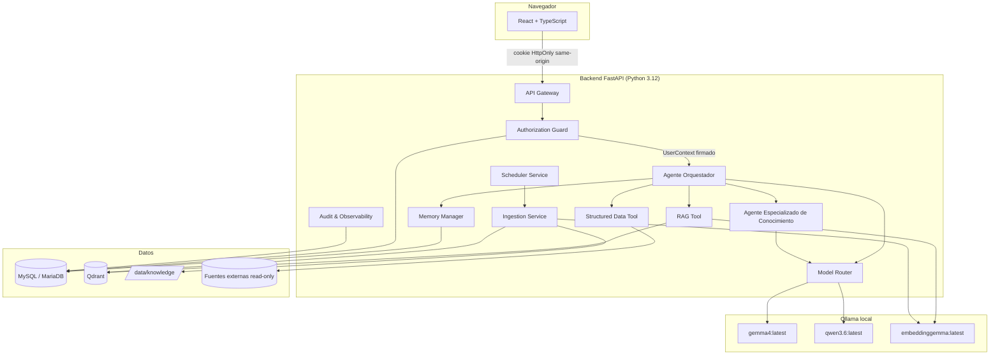
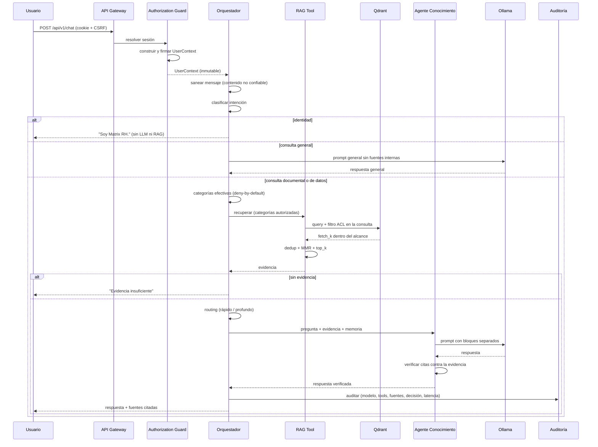
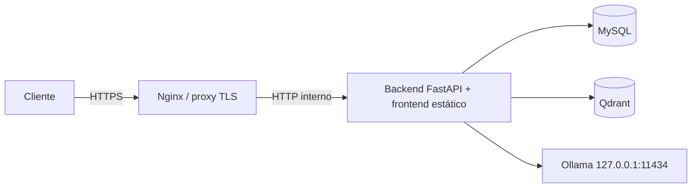

# Arquitectura — Matrix RH

> Creado por Aldo Garcia.

Base consolidada en 1.2.1, revisada en 1.2.2 conservando componentes y flujo.
La auditoría de E2E, límites y prioridades de modelos locales está en
[LOCAL_MODEL_OPTIMIZATION.md](LOCAL_MODEL_OPTIMIZATION.md).
El diagrama representa el perfil local predeterminado; los cambios por versión
están en [FINAL_CONSOLIDATION.md](FINAL_CONSOLIDATION.md).

---

## 1. Vista general



---

## 2. Componentes runtime

| # | Componente | Módulo | Responsabilidad |
|---|---|---|---|
| 1 | API / Interface Gateway | `app/api/` | Punto único de entrada. Valida sesión, CSRF, payloads y rate limits |
| 2 | Authorization Guard | `app/authorization/` | Calcula permisos efectivos y entrega un `UserContext` firmado e inmutable |
| 3 | Agente Orquestador | `app/agents/orchestrator.py` | Clasifica intención, selecciona herramientas y modelo, controla el orden, genera traza |
| 4 | Agente de Conocimiento | `app/agents/knowledge_agent.py` | Sintetiza sobre evidencia ya autorizada y verifica grounding |
| 5 | RAG Tool | `app/rag/retriever.py` | Busca sólo en chunks autorizados; devuelve evidencias, scores y metadata |
| 6 | Structured Data Tool | `app/structured_data/` | Plan JSON validado → SQL parametrizado read-only |
| 7 | Model Router / Policy | `app/llm/model_policy.py`, `app/llm/provider.py` | Selecciona perfil rápido/profundo; el adapter resuelve proveedor y modelo desde `.env` |
| 8 | Memory Manager | `app/memory/service.py` | Memoria por conversación y usuario, filtrada por permisos vigentes |
| 9 | Ingestion Service | `app/ingestion/` | Descubre, extrae, chunkea, embebe, upsert, manifest |
| 10 | Scheduler Service | `app/jobs/scheduler.py` | Reconciliación cada 24 h con lock y auditoría |
| 11 | Audit & Observability | `app/audit/`, `app/common/logging.py` | Logs JSON redactados y eventos de auditoría |

---

## 3. Flujo de un turno de chat



El punto crítico es el orden: **la autorización ocurre antes de tocar el vector
store y antes de construir el prompt**. No se filtra después.

### Resumen de un archivo adjunto

El adjunto no se mezcla con el corpus corporativo:

1. la API valida extensión, firma del formato, tamaño, rutas internas y límites
   de descompresión;
2. Ingestion Service extrae, chunkea y embebe en la colección privada;
3. cada chunk queda ligado a `owner_user_id + conversation_id`;
4. una petición de resumen hace `scroll` por metadata, sin embedding ni umbral
   semántico, usando ese filtro antes de llamar al modelo;
5. Knowledge Agent resume en una llamada o en map/reduce si el contexto no
   alcanza, verifica citas y sólo entonces devuelve contenido y fuentes;
6. borrar la conversación retira también sus vectores privados.

| Propiedad | Corpus oficial | Adjunto de chat |
|---|---|---|
| Origen | `data/knowledge/general` o `data/knowledge/especializadas` | carga del usuario |
| Colección | `matrix_rh_corporate` | `matrix_rh_private` |
| Filtro | categorías RBAC enumeradas | dueño + conversación |
| Persistencia | hasta baja/versionado documental | vida de la conversación |
| Puede publicarlo | rol con `knowledge.admin` dentro de su alcance | cualquier usuario autenticado |

El árbol y las reglas de publicación se detallan en
[`DOCUMENTATION_GOVERNANCE.md`](DOCUMENTATION_GOVERNANCE.md).

Las consultas reconocidas como RH y las referencias a políticas/documentos
recorren la ruta documental. El clasificador es de reglas y requiere evaluación
de siglas, paráfrasis y seguimientos del corpus real. La ruta general usa un
prompt independiente que prohíbe presentar conocimiento del modelo como dato
interno. El detalle y los límites están en [`AI_DESIGN.md`](AI_DESIGN.md).

---

## 4. Decisiones de arquitectura y sus motivos

| Decisión | Motivo | Alternativa descartada |
|---|---|---|
| `UserContext` firmado e inmutable | Ninguna capa posterior puede ampliar permisos; un contexto fabricado no pasa `verify()` | Pasar `user_id` entre funciones |
| Filtro ACL dentro de la consulta a Qdrant | El chunk restringido no llega ni a `fetch_k` | Recuperar y filtrar en Python |
| Plan JSON en lugar de SQL del modelo | Elimina estructuralmente la inyección desde el LLM | Validar la cadena SQL generada |
| Verificación por AST del SQL final | Defensa en profundidad frente a un futuro descuido | Confiar en la construcción |
| Runner de migraciones propio sobre SQL | El instalador Windows debe aplicar el esquema en frío, varias veces, sin estado previo | Alembic |
| Qdrant embebido por defecto | El equipo destino no tiene Docker | Exigir Docker |
| Renderizador Markdown que construye nodos React | Evita insertar HTML documental mediante `dangerouslySetInnerHTML`; enlaces y demás superficies requieren sus propios controles | `dangerouslySetInnerHTML` + DOMPurify |
| Rate limiter en memoria | Un único proceso backend; evita añadir Redis al instalador | Redis |
| Scheduler con hilo + `Event` | Única tarea periódica; interrumpible al apagar; sin dependencias | APScheduler/Celery |
| Sesión de servidor con hash del token | Un volcado de la BD no permite reutilizar sesiones | Guardar el token en claro |
| Estimación de tokens determinista | Reproducible y sin depender del tokenizador del modelo | Tokenizador exacto no expuesto por API |

---

## 5. Stack

**Backend**: Python 3.12, FastAPI, Pydantic v2, SQLAlchemy 2, PyMySQL, httpx,
PyJWT (validación OIDC), argon2-cffi, sqlglot, qdrant-client, python-docx, pypdf,
openpyxl, PyYAML.

**Frontend**: React 18 + TypeScript + Vite, Vitest + Testing Library, Playwright.

**Datos**: MySQL/MariaDB (estado de la aplicación), Qdrant (vectores),
sistema de archivos (`data/knowledge`).

**IA predeterminada**: Ollama local con `gemma4:latest`, `qwen3.6:latest`,
`embeddinggemma:latest`. Los nombres son defaults editables, no artefactos
inmutables. `InferenceClient` abstrae Ollama y API compatible local; Vertex es
opcional, está desactivado con `LLM_LOCAL_ONLY=true` y no cumple el perfil local.

---

## 6. Capas y dependencias

```text
api/  ──────────────► agents/ ──► rag/, structured_data/, memory/, llm/
  │                      │
  ├──► authorization/ ◄──┘
  ├──► auth/
  └──► security/

agents/, rag/, structured_data/, memory/, ingestion/  ──► database/, common/, config/
```

Reglas mantenidas:

- `common/` y `config/` no dependen de nadie.
- Los agentes **no** importan `api/`.
- El Agente de Conocimiento no recibe el motor de políticas ni el vector store:
  sólo objetos `Evidence` ya autorizados. Es una restricción de diseño, no una
  convención.
- Las integraciones externas se consumen por puerto/adapter
  (`IdentityProvider`, `InferenceClient`, `ReadOnlySourceAdapter`).
- La identidad visible «Matrix RH» es un contrato de producto común a ambos
  modelos; cambiar de ruta rápida a profunda no cambia el asistente ni sus ACL.

---

## 7. Topología de despliegue



MySQL, Qdrant y Ollama **no se exponen públicamente**. Sólo el proxy es accesible
desde fuera. En el arranque por doble clic (equipo local), el backend sirve
también el frontend en `127.0.0.1:8000` sin proxy. Las cabeceras se aplican desde
el backend; ese perfil HTTP de prueba no sustituye HTTPS, cookies seguras y SSO
para producción. Los cupos de admisión son por proceso: ni Qdrant servidor ni
añadir workers certifican por sí solos 200–250 usuarios concurrentes.
