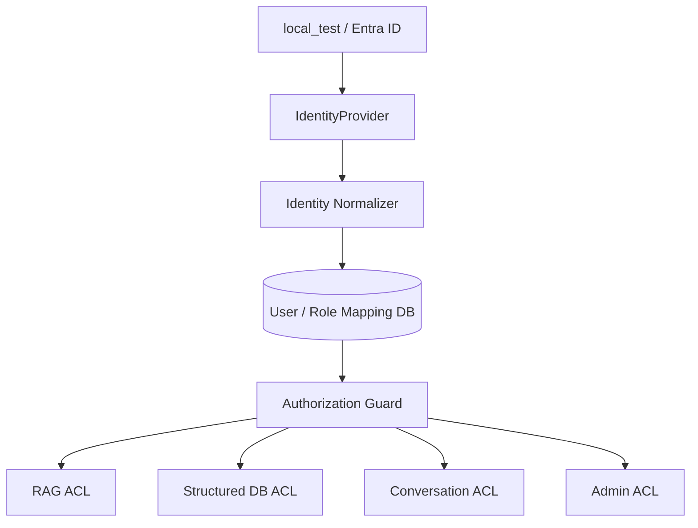

# Autenticación y Autorización — Matrix RH

> Creado por Aldo Garcia.

---

## 1. Principio rector

La autorización de Matrix RH **no depende de cómo se autenticó el usuario**. El
resto del sistema consume únicamente una `NormalizedIdentity` y las políticas
internas, de modo que sustituir el proveedor local por Microsoft Entra ID no
obliga a reescribir RAG, agentes, frontend ni políticas.



---

## 2. Contrato de identidad

`backend/app/auth/provider.py`

```text
IdentityProvider
├── start_login
├── authenticate
├── logout_url
└── status
```

La identidad normalizada produce como mínimo:

```json
{
  "subject_id": "opaque-id",
  "username": "usuario",
  "display_name": "Nombre",
  "email": null,
  "auth_source": "entra|oidc|local_test",
  "groups": [],
  "roles": []
}
```

---

## 3. Proveedor local (`local_test`)

`backend/app/auth/local_provider.py`

- Autentica contra `users` + `local_credentials` de la base interna.
- **Sólo existe con `APP_ENV=development` o `test`.** Se valida en la
  configuración (`Settings._validate_environment_safety`), otra vez al instanciar
  el adapter y una tercera vez en la ruta `/auth/local/login`.
- Contraseña verificada con **Argon2id** (`time_cost=3`, `memory_cost=64 MiB`,
  `parallelism=2`).
- Verificación *dummy* cuando el usuario no existe, para que el tiempo de
  respuesta no revele su existencia.
- Bloqueo temporal tras 5 intentos fallidos consecutivos.
- Rate limiting por IP **y** por usuario, también en local.
- Se audita el login exitoso y el fallido, nunca la contraseña.

**Nunca actúa como fallback automático si Entra ID falla en producción.**

---

## 4. Proveedor Microsoft Entra ID (`entra`)

`backend/app/auth/entra_provider.py` — estado actual `PREPARED_NOT_CONNECTED`.

- OIDC **Authorization Code Flow + PKCE (S256)**.
- Patrón **Backend-for-Frontend**: el `id_token` y el `access_token` nunca salen
  del backend. El navegador sólo recibe una cookie de sesión opaca `HttpOnly`.
- Validaciones obligatorias implementadas: `issuer`, `audience`, `exp`, `nonce`,
  `state`, firma vía JWKS, redirect URI exacta y PKCE.
- Protección ante login CSRF (cookie de correlación más `state` de un solo uso con expiración) y ante
  fijación de sesión (identificador nuevo en cada login).
- Cliente Web confidencial en producción: `client_secret` se lee del entorno.
  No se implementa autenticación mediante certificado/client_assertion.

Los pasos exactos de activación están en
[`integrations/ENTRA_ID_SETUP.md`](integrations/ENTRA_ID_SETUP.md).

---

## 5. Sesiones

`backend/app/auth/sessions.py`

| Aspecto | Decisión |
|---|---|
| Transporte | Cookie `HttpOnly`, `SameSite` configurable, `Secure` obligatorio en producción |
| Almacenamiento | Tabla `sessions`; la base guarda el **SHA-256** del token, no el token |
| Expiración | `SESSION_TTL_MINUTES` (480 por defecto) |
| Revocación | `revoked_at`; el logout revoca inmediatamente |
| Fijación de sesión | Identificador nuevo en cada login |
| CSRF | Token por sesión, exigido en la cabecera `X-CSRF-Token` de todo método mutante y comparado contra el valor del servidor |

Si se filtra un volcado de la tabla `sessions`, las cookies vivas **no** son
reutilizables porque sólo se almacena su hash.

---

## 6. UserContext

`backend/app/authorization/context.py`

- Se construye **una sola vez por request**, desde la sesión de servidor y las
  políticas de la base de datos.
- Es **inmutable** (`frozen dataclass`): ninguna capa posterior puede ampliarlo.
- Va **firmado con HMAC-SHA256** usando `APP_SECRET_KEY`; `require_valid()` falla
  cerrado si la firma no corresponde.
- **Nunca** se construye a partir de `user_id`, `role` o `groups` enviados por el
  navegador. El único insumo del cliente es la cookie opaca.

Cualquier manipulación de roles o categorías por deserialización invalida la
firma — verificado en `tests/unit/test_authorization.py::TestFirmaDelContexto`.

---

## 7. Modelo de autorización

RBAC + atributos de contexto, **deny-by-default** en todos los niveles.

| Nivel | Tabla / mecanismo |
|---|---|
| Roles | `roles`, `user_roles` |
| Permisos funcionales | `permissions`, `role_permissions` |
| Categorías documentales | `category_permissions` (`is_wildcard` para negocio) |
| Fuentes estructuradas | `structured_source_permissions` |
| Políticas ABAC adicionales | `authorization_policies` (un DENY explícito gana siempre) |
| Mapeo Entra → rol | `entra_group_role_mappings` |

### Permisos definidos

| Permiso | Concede |
|---|---|
| `knowledge.admin` | Publicar y reconciliar conocimiento corporativo dentro de las categorías efectivas del rol |
| `users.admin` | Administrar usuarios y roles |
| `structured.query` | Consultar fuentes estructuradas autorizadas |
| `diagnostics.read` | Ver el diagnóstico administrativo (sin secretos) |

**No existe** un permiso de "SQL arbitrario", "leer secretos" ni "ver el system
prompt". El usuario `Matrix`, aun siendo administrador, no obtiene acceso a
secretos de infraestructura, contraseñas, tokens ni llaves privadas: su acceso
total se refiere al conocimiento y a las fuentes de negocio configuradas.

### La wildcard

`matrix_admin_test` tiene una fila `category_permissions` con `is_wildcard=1`.
`PolicyEngine.effective_categories` la resuelve a una **lista enumerada** de
categorías conocidas y elegibles. La wildcard vive en la capa de políticas; el
filtro que llega a Qdrant sigue siendo una lista concreta.

Una categoría marcada `wildcard_eligible: false` en
`config/authorization/categories.yaml` requiere concesión nominal incluso para el
administrador de negocio (por ejemplo `nomina_confidencial` y `matrix_rh_ia`).

### Herencia acumulativa de perfiles HCM

La matriz funcional corporativa añade un invariante adicional al RBAC:
`HCM_EMP_BASICO_MX` debe estar presente en toda identidad habilitada. Los grupos
especializados se suman al base y sus concesiones se unen; nunca lo sustituyen.

| Grupos recibidos | Resultado esperado |
|---|---|
| sólo `HCM_EMP_BASICO_MX` | ámbito documental `general` |
| base + `HCM_COORD_<MODULO>_MX` | `general` + consulta del módulo |
| base + `HCM_ADM_<MODULO>_MX` | `general` + consulta y administración documental del módulo |
| especializado sin base | DENY por identidad incompleta |
| base + varios especializados | unión de los módulos enumerados, sin wildcard implícito |

Nómina General y Nómina Confidencial son recursos distintos. Las concesiones
`HCM_*_NOMINA_GRAL_MX` no alcanzan `HCM_*_NOMINA_CONF_MX`, y viceversa. El
alcance confidencial necesita concesión nominal y debe quedar excluido de
wildcards.

En el login Entra, Matrix RH sincroniza el conjunto completo de roles gobernados
por el mapeo: añade los vigentes y retira los obsoletos. Si llega un perfil
especializado sin el rol interno base `hcm_emp_basico`, no concede ningún rol HCM
efectivo. Los roles ajenos a ese mapeo no se alteran en este flujo.

La tabla completa, sin asignaciones personales, está en
[`ACCESS_PROFILES.md`](ACCESS_PROFILES.md).

### Alcance de fuentes estructuradas

La autorización efectiva es la intersección de `structured.query`,
`StructuredSourcePermission`, catálogo habilitado y credenciales read-only:

| Rol HCM | Fuentes declaradas |
|---|---|
| `hcm_adm_ia_matrix` | `rh_demo`, `postgres_analytics` |
| `hcm_adm_admpersonal` | `sap_hcm`, `oracle_hcm` |
| cualquier `hcm_coord_*` | ninguna; no recibe `structured.query` |
| otros perfiles HCM | ninguna salvo una futura declaración explícita |

El cargador de mapeo reconcilia estas filas desde `sources.yaml`; no se confía
en roles, fuentes ni permisos enviados por el navegador.

---

## 8. Matriz de autorización aplicada en desarrollo

Esta matriz valida el motor con dos cuentas sintéticas mientras Entra ID está en
estado `PREPARED_NOT_CONNECTED`. No representa el padrón de personas ni
reemplaza la matriz corporativa de grupos HCM.

| Recurso | `Matrix` | `MatrixR1` |
|---|---|---|
| `prestaciones` RAG | ALLOW | ALLOW |
| `nomina` RAG | ALLOW | DENY |
| `reclutamiento` RAG | ALLOW | DENY |
| `relaciones_laborales` RAG | ALLOW | DENY |
| `salud_ambiental` RAG | ALLOW | DENY |
| Categorías nuevas | DENY hasta política explícita y elegibilidad deliberada | DENY hasta política explícita |
| Fuentes estructuradas | ALLOW (las concedidas) | DENY por defecto |
| Administración de conocimiento | ALLOW | DENY |
| Administración de usuarios/roles | ALLOW | DENY |
| Secretos / configuración sensible | DENY por UI y chat | DENY |
| Conversaciones ajenas | DENY | DENY |

La última fila merece énfasis: **ni siquiera el administrador puede abrir la
conversación de otro usuario**. Una conversación es correspondencia privada del
empleado con el sistema; el rol administrativo cubre conocimiento y roles, no
chats de terceros.

Verificada en:
- `tests/unit/test_authorization.py::TestMatrizDeAutorizacion`
- `tests/integration/test_api_auth.py::TestOwnershipDeConversaciones`
- `tests/security/test_attack_surface.py`
- `frontend/tests/e2e/02-authorization.spec.ts`
- `backend/scripts/smoke_authorization.py`

---

## 9. Protección contra inferencia

Para un usuario restringido, Matrix RH **no**:

- devuelve títulos de documentos restringidos;
- devuelve `source_id` restringidos;
- devuelve fragmentos restringidos;
- incluye chunks restringidos en `fetch_k` (el filtro va en la consulta);
- consulta primero y filtra después;
- revela el número de documentos restringidos;
- confirma si existe una política, archivo o dato concreto restringido;
- usa memoria previa de otro usuario o rol;
- usa un resultado SQL no autorizado para sintetizar una respuesta.

Los mensajes de denegación son **genéricos y uniformes**: revelar el motivo
exacto permitiría inferir la existencia del recurso. Por la misma razón, una
conversación ajena devuelve **404**, no 403.

---

## 10. Cambios de permisos y memoria

Cada mensaje guarda las `authorized_categories` con las que se produjo. Al
reconstruir el contexto (`MemoryService.build_context`), los turnos que se
apoyaron en categorías que el rol actual ya no tiene se **descartan**. Si a un
usuario se le retira `nomina`, la respuesta de ayer sobre nómina no vuelve al
prompt de hoy.

---

## 11. Adjuntos privados vs. conocimiento corporativo

| | Adjunto de conversación | Conocimiento corporativo |
|---|---|---|
| Namespace | `user_id` + `conversation_id` | categoría |
| Colección Qdrant | `matrix_rh_private` | `matrix_rh_corporate` |
| Quién lo publica | cualquier usuario autenticado | `knowledge.admin` + categoría efectiva del rol |
| Visibilidad | sólo el dueño, sólo en esa conversación | según ACL de la categoría |
| Al borrar la conversación | se borran también sus vectores | no aplica |

`MatrixR1` puede analizar un archivo que él mismo adjunta, pero **no puede
promoverlo a una categoría corporativa** ni usarlo para evadir la ACL: la ruta de
promoción exige `knowledge.admin`. Además, un administrador especializado sólo
puede publicar o consultar el resumen administrativo de sus categorías
efectivas; el backend guarda las cargas nuevas en `general/` o en
`especializadas/<dominio>/` según corresponda.

---

## 12. Transición de local a Entra ID

El esquema ya permite asociar:

```text
entra object id / subject
        -> identity_links
        -> users
        -> user_roles
        -> role / category / source policies
```

Toda la autorización validada con `Matrix` y `MatrixR1` se reutiliza tal cual al
activar Entra ID. Ver
[`integrations/MIGRATE_LOCAL_TEST_TO_ENTRA.md`](integrations/MIGRATE_LOCAL_TEST_TO_ENTRA.md).

La activación corporativa no está completa hasta elegir app roles `HCM_*` o
object IDs reales de grupo, cargar el mapeo, aplicar las concesiones por dominio
y ejecutar pruebas positivas/negativas de Nómina General y Nómina Confidencial
por separado.

En 1.2.0 se añade AUTH_PROVIDER=oidc para un IdP interno; Entra permanece disponible e inactivo por defecto. Consulte el [checklist de AD/OIDC](integrations/AD_ACTIVATION_CHECKLIST.md).
