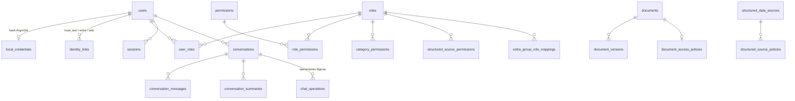

# Modelo de datos — Matrix RH

> Creado por Aldo Garcia.

Base interna: **MySQL / MariaDB**, motor InnoDB, `utf8mb4_unicode_ci`.
Claves primarias opacas `CHAR(36)` (UUID4): no revelan orden ni volumen.

El DDL vive en `backend/migrations/*.sql`; el ORM en
`backend/app/database/models.py`. La prueba
`tests/integration/test_schema_and_seed.py::test_el_esquema_real_coincide_con_los_modelos_orm`
compara ambos contra `information_schema` para impedir que se desincronicen.

---

## 1. Diagrama

---

## 2. Tablas

### Identidad y acceso

| Tabla | Papel | Notas de seguridad |
|---|---|---|
| `users` | Usuario lógico | `is_synthetic_test` marca las cuentas de prueba para poder deshabilitarlas en bloque |
| `local_credentials` | Credencial de development/test | **Sólo** `password_hash_argon2id`. Nunca texto plano |
| `identity_links` | `(provider, subject_id) → user` | Permite activar Entra ID sin reescribir roles |
| `roles`, `permissions`, `role_permissions`, `user_roles` | RBAC | — |
| `entra_group_role_mappings` | Grupo/app-role externo → rol interno | Sin mapeo, el usuario queda **sin** permisos |
| `category_permissions` | Acceso por categoría documental | `is_wildcard` para el administrador de negocio |
| `structured_source_permissions` | Acceso por fuente estructurada | — |
| `authorization_policies` | ABAC ligero | Un `DENY` explícito gana siempre |
| `sessions` | Sesión de servidor | Guarda **SHA-256** del token, no el token |
| `oidc_login_states` | `state` + `nonce` + PKCE verifier | De un solo uso, con expiración |

### Conversación

| Tabla | Papel | Notas |
|---|---|---|
| `conversations` | Hilo por usuario | Borrado lógico con `deleted_at` |
| `conversation_messages` | Turnos | `authorized_categories` y `authorization_scope` identifican el alcance de producción |
| `conversation_summaries` | Resumen de diálogo | Su reutilización exige `authorization_scope` vigente; el prompt prohíbe contenido factual |
| `chat_operations` | Solicitudes identificables e idempotentes | Owner, conversación, hash de request/alcance, estado y resultado; vínculo lógico, sin FK declarada en 0006 |

`conversation_messages.authorized_categories` es la clave del requisito de
"reconstruir el contexto sólo con información que continúe autorizada": si los
permisos cambian, los turnos apoyados en categorías ya no autorizadas se
descartan al reconstruir el prompt.

La migración `0004_memory_authorization` añade una huella de alcance a mensajes
y resúmenes. El historial y la memoria filtran también por esa huella; `NULL`
identifica legado sin procedencia verificable y no se completa automáticamente
con los permisos actuales. La autorización se revalida antes de publicar
resultados de inferencia y de recuperar operaciones persistidas.

### Documentos e ingesta

| Tabla | Papel | Notas |
|---|---|---|
| `documents` | Manifest actual | `scope` = `corporate` \| `conversation`; `sha256`, `chunk_count`, `status`, `ingestion_version`, `active_generation`, `index_fingerprint`, `index_cleanup_pending` |
| `document_versions` | Histórico de reindexados | — |
| `document_access_policies` | ACL derivada de la categoría | `sensitivity`, `source_owner` |
| `ingestion_jobs` | Ejecuciones de reconciliación | `trigger_source` (`trigger` es palabra reservada en MySQL) |
| `job_locks` | Lock cooperativo | Con expiración, para que un proceso muerto no lo retenga |

### Fuentes estructuradas

| Tabla | Papel | Notas |
|---|---|---|
| `structured_data_sources` | Catálogo | `secret_ref` es el **nombre** de la variable de entorno, nunca el DSN |
| `structured_source_policies` | Columnas y filtros permitidos por entidad | — |

### Auditoría

| Tabla | Papel |
|---|---|
| `audit_events` | Identidad opaca, hash de roles, intención, modelo, tools, `source_ids`, decisión de autorización, latencia, estado y código de error |
| `schema_migrations` | Versión + checksum de cada migración aplicada |

---

## 3. Índices

| Índice | Consulta que sirve |
|---|---|
| `ix_conversations_owner (user_id, deleted_at, updated_at)` | Listado de conversaciones propias |
| `ix_messages_conversation (conversation_id, created_at)` | Reconstrucción del hilo |
| `ix_documents_sha (sha256)` | Detección de cambios en la reconciliación |
| `ix_documents_category (category, deleted_at)` | Resumen por categoría |
| `ix_documents_scope_path (scope, relative_path)` | Búsqueda por ruta en la reconciliación |
| `ix_ingestion_jobs_status (status, started_at)` | Estado de los jobs |
| `ix_audit_request (request_id)` | Correlación de un request completo |
| `ix_audit_user_time (user_opaque_id, created_at)` | Auditoría por usuario |
| `ix_sessions_expires (expires_at)` | Purga de sesiones caducadas |

---

## 4. Reglas de datos

1. **Ninguna tabla almacena secretos de conexión en texto plano.** Se guarda la
   referencia lógica al secreto externo.
2. **Ninguna tabla almacena la contraseña de un usuario de Entra ID.**
3. Las contraseñas locales sólo existen como hash Argon2id.
4. Los identificadores expuestos por la API son opacos y siempre se validan
   contra ownership/ACL.
5. El borrado de conversaciones es lógico en la base y retira la generación
   visible. La eliminación física de puntos se coordina con el reconciliador;
   mientras está pendiente, los filtros de generación impiden recuperarlos.

Las migraciones `0004_memory_authorization`, `0005_index_generations` y
`0006_chat_operations` se añaden a las anteriores sin reescribir sus checksums.
No hay transacción ACID compartida con Qdrant: la activación SQL coordina
visibilidad y la bandera durable solicita limpieza posterior.

---

## 5. Migraciones

`backend/app/database/migrator.py`

- Archivos `NNNN_nombre.sql`, aplicados en orden y registrados con su checksum.
- Reejecutables: todas las sentencias son `IF NOT EXISTS` o `ALTER` idempotentes.
- Si una migración ya aplicada cambia de contenido, el runner **falla** en lugar
  de reaplicarla: una migración mutada en silencio es una fuente clásica de
  divergencia entre entornos.
- `assert_database_is_ours` impide adoptar una base que ya contiene tablas de
  otra aplicación. (Escenario real encontrado durante la construcción: el equipo
  destino tenía una base `matrix_rh` de otro proyecto.)

| Versión | Contenido |
|---|---|
| `0001_initial_schema.sql` | Esquema completo |
| `0002_widen_audit_status.sql` | Amplía `audit_events.status`, `authorization_decision` e `ingestion_jobs.status` |

---

## 6. Retención

| Dato | Política sugerida |
|---|---|
| Conversaciones | Borrado por el propio usuario; retención corporativa configurable |
| Mensajes | Con su conversación |
| Sesiones caducadas | `purge_expired_sessions()` |
| `audit_events` | Retener según política de cumplimiento (no se purga automáticamente) |
| Adjuntos privados | Se eliminan con su conversación, incluidos los vectores |
