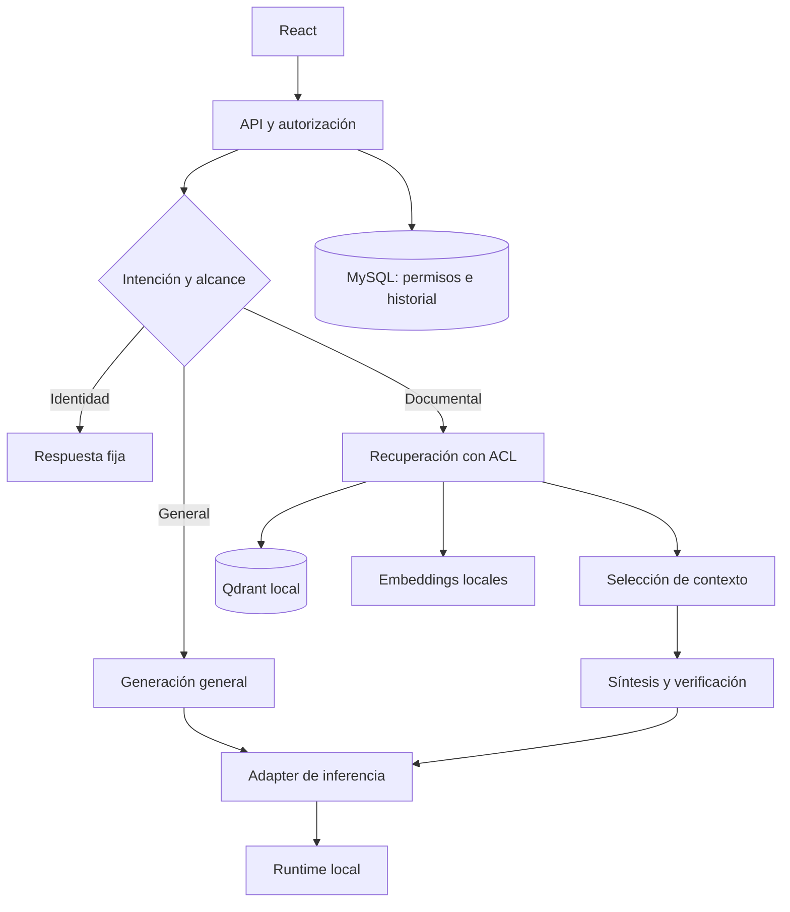

# Aprovechamiento de modelos locales — Matrix RH

> Creado por Aldo Garcia. Revisión 1.2.2, 2026-09-10.

El objetivo es maximizar respuestas útiles, respaldadas y completadas dentro del
SLO por unidad de hardware. GPU al 100%, contexto máximo y un modelo mayor no
son por sí solos criterios de éxito. Ninguna configuración garantiza respuestas
siempre verdaderas; una abstención correcta es necesaria cuando faltan fuentes.

## 1. Decisión de arquitectura

Conservar FastAPI, React, MySQL, Qdrant y los adapters existentes. Las capas de
autorización, memoria, recuperación, síntesis e inferencia ya están separadas y
permiten cambios incrementales. Mantener AD/Entra desactivado hasta la activación
por TI; usar el IdP interno para el perfil de producción completamente local.

Para el objetivo de concurrencia, utilizar Qdrant servidor interno y programar
los trabajos de inferencia con cupos compartidos antes de añadir procesos API.
El perfil embebido y los contadores en memoria corresponden a un proceso.
Una cola futura debe ser acotada, con prioridad interactiva, cancelación y
estado persistente; incrementar workers no crea capacidad GPU.



## 2. Diagnóstico antes de ajustar

Desde la raíz del proyecto instalado en Windows:

```bat
set "PYTHONPATH=%CD%\backend"
.venv\Scripts\python.exe -m scripts.local_model_diagnostics --output reports\local-models.json
```

Desde un checkout Linux que usa el venv en `backend`:

```bash
backend/.venv/bin/python -m scripts.local_model_diagnostics --output reports/local-models.json
```

El comando lee configuración y metadata de Ollama, sin generar respuestas,
descargar pesos, cargar modelos, abrir la base ni consultar documentos. Informa
GPU/VRAM si está disponible `nvidia-smi`; la ausencia de esa herramienta no
demuestra que el servidor carezca de cualquier GPU. Los providers compatibles y
cloud se describen sin contactarlos. Una dependencia no disponible se registra
como tal; no se presenta como prueba satisfactoria de rendimiento.

Capturar también, en el servidor Ollama, `ollama --version`, `ollama ps` y las
variables operativas efectivas. `/api/ps` expone memoria y contexto de los modelos
cargados, pero no todos los ajustes del scheduler. La memoria del equipo donde
se ejecuta el diagnóstico puede ser distinta de la del servidor Ollama remoto.
[API oficial de modelos cargados](https://docs.ollama.com/api/ps).

## 3. Parámetros presentes y experimentos

Estos son defaults del código, no resultados medidos ni el inventario del servidor.

| Variable / perfil | Default | Decisión de ajuste |
|---|---:|---|
| Generador rápido | `gemma4:latest`, contexto 8192, salida 768 | Confirmar variante, digest, cuantización y capacidad de responder con evidencia completa |
| Generador profundo | `qwen3.6:latest`, contexto 32768, salida 2048 | Mantener solo si mejora calidad en casos complejos y su latencia cabe en el SLO |
| Embeddings | `embeddinggemma:latest`, dimensión 768 | Mantener huella y prefijos; cambiar requiere reindexación |
| Fragmento / solape | 900 / 120 tokens estimados | Evaluar fragmentación por sección y tabla; salida 768 puede no alojar una unidad completa de 900 |
| Recuperación | fetch 24, top 6, MMR 0.65, similitud 0.35 | Calibrar Recall y precisión con fuentes esperadas; no son parámetros universales |
| Cupos por proceso | chat 4, inferencia 2, upload 1 | Subir únicamente si crecen respuestas útiles/s y se conserva latencia/calidad |
| Retención de modelos | 15 minutos | Medir recargas y convivencia con embeddings; no forzar todos los pesos residentes si no caben |
| Deadline de solicitud | 120 segundos | Medir cola y duración por tarea; un timeout alto no resuelve saturación |

Orden de experimentos en una copia de pruebas, con los mismos documentos y preguntas:

1. Congelar versiones, digests, cuantización, configuración y corpus. Registrar
   estado frío y repetir en caliente; no ocultar tiempo de carga al comparar.
2. Concurrencia 1: medir rápido y profundo por separado con las mismas tareas y
   valoración de RH. Comparar respuestas correctas, abstenciones indebidas,
   citas válidas, latencia y tokens/s. Elegir el generador principal por esos datos.
3. Ajustar contexto y salida al material necesario. Probar 4K/8K para preguntas
   cortas y 8K/16K/32K para resúmenes solo cuando modelo/VRAM lo permitan. Son
   puntos de ensayo, no una recomendación de reducir contexto a ciegas.
4. Probar concurrencia 1→2→4 y luego 10/20 si el servicio es estable. Medir
   rechazos además de respuestas completadas; no ocultar los 503 en el promedio.
5. Comparar el profundo con el principal en el subconjunto difícil. Un segundo
   modelo que recarga pesos o repite respuestas sin mejora medida no aporta valor.
6. Tras controlar colas, cancelación y recuperación, ejecutar 200 sostenidos y
   250 en pico con identidades distintas, datos sintéticos y SLO acordados.

Hay un límite pendiente: `generation_profile()` identifica el perfil por nombre
de modelo. Si rápido y profundo comparten nombre con presupuestos diferentes,
puede aplicarse el presupuesto profundo a la ruta rápida. Hasta separar perfil
de identificador, usar nombres distintos o presupuestos iguales para ese caso.

La concurrencia de Ollama multiplica el espacio de contexto y consume memoria.
Flash Attention y KV `q8_0` son candidatos de ensayo cuando el backend los soporte;
mantenerlos solo si no deterioran exactitud, especialmente con contexto largo.
Configurar estas variables en el proceso Ollama y reiniciarlo: ponerlas solo en
el `.env` de Matrix no modifica un Ollama que ya está ejecutándose. Mantener
`LLM_LOCAL_ONLY=true` y deshabilitar las funciones cloud del propio runtime con
`OLLAMA_NO_CLOUD=1` cuando la versión instalada lo admita.
[Configuración y concurrencia de Ollama](https://docs.ollama.com/faq).

## 4. Medir lo que limita la respuesta

Los eventos JSON `llm.chat` incluyen en 1.2.2 conteos, `load_duration_ns`,
`prompt_eval_duration_ns`, `eval_duration_ns` y velocidad de generación.
`generation_tokens_per_second = eval_count / (eval_duration_ns / 1e9)`.
Son valores informados por Ollama; ausente se conserva como `null`. No contienen
prompts ni respuesta. El ID de solicitud del logging permite correlacionarlos
con el turno cuando el contexto se propaga. No se ha añadido un panel, una
medida sostenida de GPU ni telemetría equivalente de todos los providers.
[Campos oficiales de chat](https://docs.ollama.com/api/chat).

La ruta actual usa `stream=false`: latencia total no es TTFT. Añadir streaming
requiere mantener la respuesta no verificada fuera de la UI hasta validarla,
o diseñar una presentación explícita de contenido provisional. No publicar
texto de RH sin comprobarlo solo para reducir el tiempo aparente de espera.

| Señal observada | Acción que debe investigarse |
|---|---|
| Carga alta repetida | Cambios de modelo, residencia y capacidad VRAM |
| Evaluación del prompt dominante | Evidencia irrelevante, contexto sobredimensionado, cache y formato |
| Generación lenta y offload a CPU | Modelo/cuántización/contexto fuera del presupuesto de VRAM |
| Dos generaciones con igual resultado | Escalamiento por cobertura de citas y controles demasiado rígidos |
| Muchas abstenciones con fuentes correctas | Contrato extractivo frente a paráfrasis, salida insuficiente |
| Respuestas fluidas sin respaldo | Clasificación, recuperación, relevancia y verificación factual |
| GPU ocupada tras cancelar | Cancelación solo persistida, falta interrupción del trabajo |

## 5. Calidad antes de fine-tuning

Primero cerrar pertinencia y soporte factual. La comparación textual vigente
conserva condiciones, pero no demuestra que el texto responda a la pregunta.
No debe relajarse a coincidencia parcial: eso reintroduce pérdida de negaciones.
Diseñar afirmaciones vinculadas a unidades de evidencia, verificar cifras y
condiciones, y evaluar un verificador local en un conjunto reservado. El coste
de esa verificación debe medirse junto con latencia y tasa de errores.

Ensayar búsqueda híbrida y reranking locales después de contar con la medición
de recuperación. Comparar dense+MMR actual frente a cada mejora manteniendo ACL
antes de ranking. Evitar multi-query por defecto: añade inferencia y candidatos,
y puede empeorar latencia sin elevar Recall. Tablas requieren filas completas y
encabezados repetidos al fragmentarlas; OCR/PPTX siguen fuera del alcance actual.

No entrenar todavía: las reproducciones señalan fallos de routing, selección,
fragmentación y validación, no una carencia demostrada de los pesos. La decisión
de fine-tuning y el posible piloto Unsloth siguen documentados en
[LOCAL_FINETUNING.md](LOCAL_FINETUNING.md). Hace falta comparar base y ajuste con
evidencia correcta antes de atribuir un beneficio al entrenamiento.

## 6. E2E y aceptación real

Ejecutar validación completa únicamente en una copia aislada de pruebas:
`APP_ENV=test`, BD `matrix_rh_test` o `matrix_rh_test_<sufijo>`,
`MATRIX_TEST_ALLOW_DESTRUCTIVE=true`, uploads/Qdrant embebido dentro de
`var/tests`, o colecciones servidor `matrix_rh_test_*`. Las suites pueden borrar
datos. El guard comprueba configuración; el operador debe asegurar que la copia
solo contiene datos sintéticos. Consultar [TESTING.md](TESTING.md).

| Familia | Criterio de aceptación propuesto |
|---|---|
| Chat documental y seguimiento | Hecho esperado, fuente/versión/ámbito correctos; no basta HTTP 200 |
| Archivo vs corpus | Resumen del ámbito solicitado; múltiples archivos nombrados requieren casos adicionales |
| Permisos | Cero fugas observadas al cambiar rol, reabrir, resumir y resolver turnos pendientes |
| Negación y excepción | Conservar sujeto, unidad, periodo, condición y restricciones |
| Modelos intercambiables | Misma batería y schema mediante `.env`; medir ambos, no solo el adapter simulado |
| Saturación/cancelación | Trabajo acotado, resultado correlacionado, ausencia de duplicados, recuperación medible |
| Reinicio/actualización | Historial consistente, índices activos, adjuntos y revisión documental recuperados |

Los umbrales de latencia son una decisión de servicio que debe fijarse antes de
la carga. El requisito de 200–250 consultas no se aprueba con tests unitarios ni
con el listado de Playwright. Revisar los resultados de esta entrega en
[LOCAL_ARCHITECTURE_E2E_AUDIT.md](../reports/LOCAL_ARCHITECTURE_E2E_AUDIT.md).
