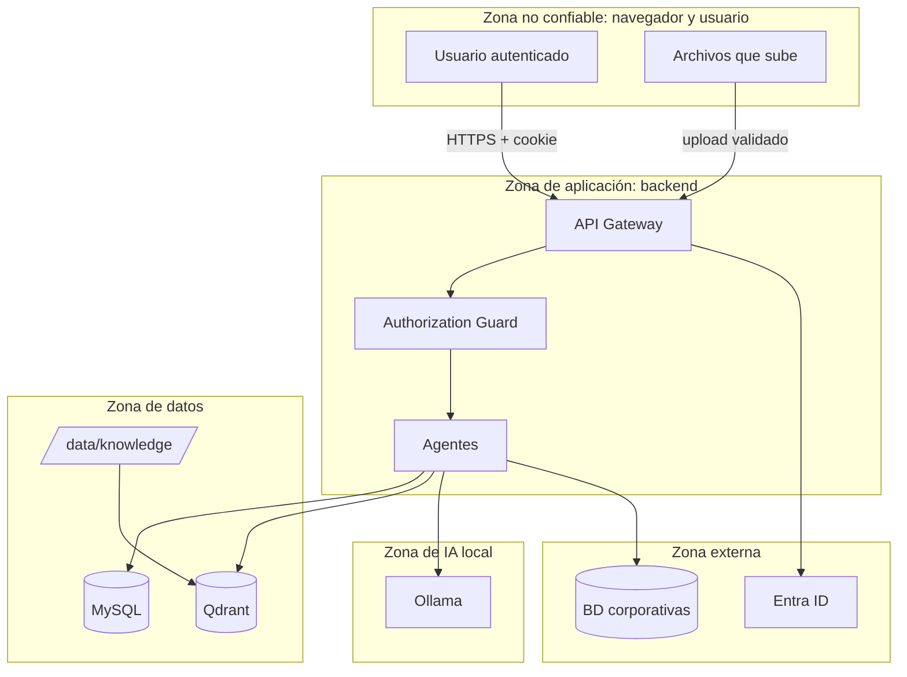

# Modelo de amenazas — Matrix RH

> Creado por Aldo Garcia.

Metodología: STRIDE por límite de confianza, con un apartado específico para
amenazas de LLM/RAG.

---

## 1. Límites de confianza

| Límite | Qué lo cruza | Control principal |
|---|---|---|
| Navegador → Backend | Cookie de sesión, mensajes, archivos | Sesión de servidor, CSRF, validación Pydantic, upload guard |
| Backend → Qdrant | Consulta + filtro ACL | El filtro forma parte de la consulta |
| Backend → runtime local | Prompt con evidencia ya autorizada, que puede ser sensible | ACL previa, runtime interno y `LLM_LOCAL_ONLY=true`; el contenido autorizado sí entra al prompt |
| Backend → BD externas | SQL parametrizado | Plan validado + AST + cuenta read-only |
| Backend → Entra ID / OIDC interno | Código de autorización | PKCE, cookie de correlación del navegador, state de un uso, nonce y JWKS |
| Disco → Índice | Documentos corporativos | Categoría = carpeta, deny-by-default |

---

## 2. Activos

| Activo | Impacto si se compromete |
|---|---|
| Documentación restringida de RH (nómina, relaciones laborales) | Alto — información laboral sensible |
| Conversaciones de empleados | Alto — correspondencia privada |
| Credenciales de Entra ID y DSN de bases corporativas | Crítico — acceso lateral |
| `APP_SECRET_KEY` | Crítico — permitiría forjar un `UserContext` |
| Hashes Argon2id de cuentas de prueba | Bajo — cuentas sintéticas, se eliminan antes de producción |
| Integridad del índice vectorial | Alto — envenenarlo altera respuestas |
| Disponibilidad del servicio | Medio |

---

## 3. Actores

| Actor | Motivación | Capacidad |
|---|---|---|
| Empleado curioso autenticado | Ver información de otras áreas | Sesión válida, sabe usar DevTools |
| Empleado malicioso | Exfiltrar nómina o expedientes | Puede subir documentos |
| Atacante externo sin credenciales | Acceso inicial | Sólo el puerto del proxy |
| Insider con acceso al repositorio | Secretos | Lee el código |
| Autor de un documento envenenado | Manipular respuestas | Consigue que un documento entre al corpus |

---

## 4. STRIDE

### Spoofing

| Amenaza | Control | Prueba |
|---|---|---|
| Suplantar a otro usuario por cabeceras (`X-User-Id`, `X-Roles`) | El contexto se construye sólo desde la cookie | `test_cabeceras_de_identidad_falsificadas_se_ignoran` |
| Cookie de sesión falsificada | Token aleatorio de 32 bytes; la BD guarda su SHA-256 | `test_una_cookie_falsificada_no_abre_sesion` |
| Fijación de sesión | Identificador nuevo en cada login | `create_session` |
| Login CSRF en OIDC | `state` de un solo uso con expiración | `_consume_state` |
| Token de identidad falsificado | Firma JWKS + iss + aud + exp + nonce | `validate_id_token` |

### Tampering

| Amenaza | Control | Prueba |
|---|---|---|
| Alterar roles del `UserContext` | Firma HMAC; `require_valid` falla cerrado | `TestFirmaDelContexto` |
| Alterar el plan de consulta | Pydantic `extra=forbid` + validador de política | `TestEsquemaDelPlan` |
| Inyección SQL por valores | Parámetros nombrados; el valor nunca entra al SQL | `test_el_valor_malicioso_no_altera_la_sentencia` |
| Path traversal en `filename` | Nombre interno UUID + `resolve_within` | `TestRutasSeguras` |
| CSRF en operaciones mutantes | Token de sesión en `X-CSRF-Token` | `TestSesionYCsrf` |

### Repudiation

| Amenaza | Control |
|---|---|
| Negar haber consultado datos restringidos | `audit_events` con identidad, intención, modelo, tools, fuentes, decisión y latencia |
| Manipular la evidencia de auditoría | Los eventos se escriben en la misma transacción del request |

### Information disclosure

| Amenaza | Control | Prueba |
|---|---|---|
| Recuperar chunks de categorías no autorizadas | Filtro ACL dentro de la consulta a Qdrant | Golden set, `denied_pass_rate = 100 %` |
| Inferir existencia de documentos restringidos | Mensajes de denegación genéricos; sin conteos ni títulos | `leak-01..03` del golden set |
| Enumerar recursos por IDOR | IDs opacos UUID; 404 en lugar de 403 | `TestIdorBola` |
| Secretos en logs | Redacción en el formatter | `TestRedaccion` |
| Secretos en respuestas de error | Sólo `code`, `message`, `request_id` | `test_los_errores_no_filtran_detalles_internos` |
| Tokens accesibles al JavaScript | Cookie `HttpOnly`, patrón BFF | E2E de almacenamiento |
| Secretos en el diagnóstico | Sólo parámetros; verificado por lista negra | `test_matrix_accede_al_diagnostico_sin_secretos` |

### Denial of service

| Amenaza | Control |
|---|---|
| Fuerza bruta de login | Rate limiting por IP y por usuario + bloqueo temporal |
| Inundación de chat | Rate limiting por usuario |
| Zip bomb en OOXML | Límites de entradas, tamaño descomprimido y ratio |
| PDF/XLSX gigantes | Límites de páginas, hojas, filas y celdas |
| Payloads enormes | Límites de longitud en todos los modelos Pydantic |
| Reconciliación concurrente | Lock cooperativo con expiración |

### Elevation of privilege

| Amenaza | Control | Prueba |
|---|---|---|
| Usuario restringido publica conocimiento corporativo | Requiere `knowledge.admin` | `test_matrixr1_no_puede_publicar_conocimiento_corporativo` |
| Promover un adjunto privado a categoría restringida | La ruta de promoción exige permiso administrativo | Sección 11 de AUTHENTICATION_AUTHORIZATION |
| Administrador lee conversaciones ajenas | Ownership estricto, sin excepción por rol | `TestOwnershipDeConversaciones` |
| Categoría nueva concede acceso por conveniencia | Deny-by-default explícito | `test_categoria_nueva_denegada_para_restringido` |
| Modo local habilitado en producción | El arranque falla | `TestSeguridadDeEntorno` |

---

## 5. Amenazas específicas de LLM y RAG

| Amenaza | Control | Prueba |
|---|---|---|
| Prompt injection directa | Reglas del system policy + sin herramientas de escalada | E2E 14 |
| Prompt injection dentro de un documento | Sanitización de marcadores + contenido marcado como no confiable + ACL previa | E2E 14, `TestPromptGuard` |
| "Ignora el sistema" | Regla 5 del system policy; el modelo no puede ejecutar nada | `test_detecta_senales_de_inyeccion` |
| Leer documentos de otro rol | Filtro ACL en la consulta | Golden set `denied` |
| Pedir secretos o el system prompt | Regla 6 + los secretos no están en el contexto | `unsup-03` del golden set |
| Data poisoning del RAG | Sólo `knowledge.admin` publica; SHA-256 por documento; adjuntos privados aislados | `test_zip_bomb_ooxml`, ACL privada |
| Source ID inventado | `verify_grounding` rechaza la síntesis | `test_source_id_inventado_se_rechaza` |
| Memoria usada como evidencia falsa | Bloque separado marcado "NO es evidencia factual" | `test_los_bloques_estan_separados` |
| Tool call fuera de permisos | El agente de conocimiento no recibe herramientas | Diseño |
| SQL malicioso disfrazado de petición natural | Plan JSON + validador + AST | `TestVerificacionPorAst` |
| Fuga entre conversaciones | Filtro por `conversation_id` en el namespace privado | E2E 03 |

---

## 6. Riesgo residual aceptado

| ID | Riesgo | Mitigación | Estado |
|---|---|---|---|
| RR-01 | Ensamblado de SQL por interpolación de identificadores | Allowlist + regex + citado + parámetros + AST | Aceptado, documentado |
| RR-02 | Rate limiter en memoria: no coordina varias réplicas | Despliegue de un único proceso backend; interfaz sustituible | Aceptado para la topología actual |
| RR-03 | Qdrant embebido admite un solo proceso | Documentado; `QDRANT_MODE=server` lo resuelve | Aceptado |
| RR-04 | La estimación de tokens es aproximada (~10 %) | Márgenes holgados en 900/120 | Aceptado |
| RR-05 | Entra ID no validado contra un tenant real | Adapter completo + pruebas con JWKS local + guía de activación | `PREPARED_NOT_CONNECTED` |
| RR-06 | `style-src 'unsafe-inline'` en la CSP | `script-src` sigue estricto; sin `dangerouslySetInnerHTML` | Aceptado |
| RR-07 | Las cuentas sintéticas tienen contraseña conocida | Sólo `development`/`test`; el arranque falla en producción | Aceptado |

---

## 7. Copias de seguridad y recuperación

| Elemento | Respaldo | Recuperación |
|---|---|---|
| Base interna | `mysqldump` de `matrix_rh` | Restaurar y ejecutar migraciones |
| Índice vectorial | No requiere respaldo | Se reconstruye con `scripts.bootstrap ingest` |
| Conocimiento | Respaldo del árbol `data/knowledge` | Copiar y reconciliar |
| Configuración | `.env` fuera del repositorio, en el gestor de secretos | Volver a generar `APP_SECRET_KEY` invalida sesiones vivas |

---

## 8. Respuesta a incidentes (básico)

1. **Contener**: `DETENER_MATRIX_RH.bat`; si hay sospecha de sesión comprometida,
   revocar todas las sesiones del usuario (`revoke_all_user_sessions`).
2. **Evidenciar**: conservar `var/logs/` y consultar `audit_events` por
   `request_id`, `user_opaque_id` y `authorization_decision`.
3. **Erradicar**: rotar `APP_SECRET_KEY` (invalida las firmas), rotar el
   `client_secret` de Entra ID y los DSN afectados.
4. **Recuperar**: `windows\Validate-MatrixRH.ps1` antes de volver a exponer el servicio.
5. **Aprender**: registrar el hallazgo en `reports/security/` y añadir la prueba
   automatizada correspondiente.
