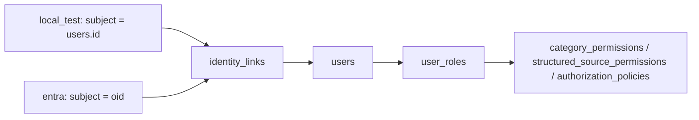

# Diseño del proveedor de identidad — Matrix RH

> Creado por Aldo Garcia.

---

## 1. Por qué existe la abstracción

Matrix RH tenía que ser **completamente testeable** antes de disponer de un
tenant de Microsoft Entra ID. La solución no fue simular Entra ID, sino separar
dos cosas que suelen mezclarse:

- **quién eres** — responsabilidad del proveedor de identidad;
- **qué puedes ver** — responsabilidad del motor de políticas de Matrix RH.

Sólo la primera cambia al conectar Entra ID. La segunda ya está validada con
`Matrix` y `MatrixR1` y se reutiliza sin tocarla.

---

## 2. El puerto

`backend/app/auth/provider.py`

```python
class IdentityProvider(ABC):
    name: str
    def start_login(self, session, *, redirect_after=None) -> LoginChallenge: ...
    def authenticate(self, session, **kwargs) -> NormalizedIdentity: ...
    def logout_url(self) -> str | None: ...
    def status(self) -> IntegrationStatus: ...
```

Y la identidad normalizada:

```python
@dataclass(frozen=True, slots=True)
class NormalizedIdentity:
    subject_id: str
    username: str
    display_name: str
    email: str | None
    auth_source: str        # "entra" | "oidc" | "local_test"
    groups: tuple[str, ...]
    roles: tuple[str, ...]
```

**Nada fuera de `app/auth/` sabe qué proveedor se usó.** El orquestador, el RAG,
la tool de datos y el frontend consumen `UserContext`, que se construye siempre
igual.

---

## 3. Adapters y compatibilidad

| | `local_test` | `entra` |
|---|---|---|
| Entorno | `development` / `test` únicamente | cualquiera |
| Mecanismo | Formulario + Argon2id contra la base interna | OIDC Authorization Code + PKCE |
| Dónde viven los tokens | No hay tokens | Sólo en el backend (BFF) |
| `subject_id` | `users.id` | `oid` (o `sub`) del token |
| Grupos | vacío | claim `groups` |
| Roles del proveedor | vacío | claim `roles` (app roles) |
| Estado típico | `CONNECTED_AND_VALIDATED` | `PREPARED_NOT_CONNECTED` |

La tabla conserva los dos proveedores originales. Desde 1.2.0 existe también
`OidcIdentityProvider` (`AUTH_PROVIDER=oidc`) para un IdP interno como Keycloak,
con issuer, endpoints, cliente y secreto configurables. Reutiliza las validaciones
OIDC y representa el subject como hash de `issuer|sub`; el logout revoca la
sesión Matrix, no necesariamente la sesión del IdP. Puede federarse con AD desde
el IdP. Matrix no implementa LDAP/LDAPS ni SAML directos.

El estado de conectividad de discovery/JWKS no acredita que una persona haya
completado SSO. La activación real permanece pendiente de TI; véase
[AD_ACTIVATION_CHECKLIST.md](AD_ACTIVATION_CHECKLIST.md).

La selección la hace `get_identity_provider()` según `AUTH_PROVIDER`. **No existe
fallback automático**: si Entra ID falla en producción, la petición falla; nunca
se cae al proveedor local.

---

## 4. Vinculación de identidades



`identity_links` tiene clave única `(provider, subject_id)`. Un mismo usuario
lógico puede tener enlaces de ambos proveedores, lo que permite una migración
gradual: se añade el enlace de Entra al `users` existente y los roles se
conservan.

---

## 5. Alta de usuario con Entra ID

`_upsert_user_from_identity` en `app/api/routes/auth.py`:

1. Si existe `identity_links(entra, oid)` → usuario conocido.
2. Si no, se busca por `username`; si tampoco existe, se crea.
3. Se crea el `identity_links`.
4. Se aplica `_sync_entra_roles`: los grupos y app roles del token se buscan en
   `entra_group_role_mappings` y se conceden los roles internos resultantes.

**Si ningún grupo mapea a un rol, el usuario queda sin permisos.** Deny-by-default
también en el alta.

---

## 6. Por qué el patrón BFF

| Alternativa | Problema |
|---|---|
| SPA que guarda el `access_token` | Cualquier XSS lo roba; `localStorage` es legible por script |
| SPA con token en memoria | Sobrevive menos, pero sigue siendo accesible al JavaScript |
| **BFF con cookie `HttpOnly`** | El token nunca llega al navegador; un XSS no puede leerlo |

Matrix RH usa BFF. El navegador recibe únicamente un identificador de sesión
opaco, y la base guarda su SHA-256.

---

## 7. Cómo se prueba sin tenant

| Aspecto | Cómo |
|---|---|
| Contrato del puerto | Ambos adapters implementan `IdentityProvider`; las pruebas del motor de políticas usan `NormalizedIdentity` sin saber de dónde viene |
| Validación del `id_token` | `validate_id_token(..., signing_key=...)` acepta una clave inyectada: las pruebas generan un par RSA local y firman un token con `iss`, `aud`, `exp` y `nonce` coherentes |
| `state` y PKCE | Se ejercitan contra la tabla `oidc_login_states` real |
| Mapeo de grupos | `entra_group_role_mappings` se puebla con identificadores de prueba |
| Estado honesto | `status()` devuelve `PREPARED_NOT_CONNECTED` mientras las variables sean marcadores |

Lo único que **no** se puede probar sin tenant es la conectividad real con
`login.microsoftonline.com`. Por eso el estado no es `CONNECTED_AND_VALIDATED`.

---

## 8. Extender a otro proveedor

Para un protocolo nuevo, por ejemplo SAML directo (Keycloak OIDC ya está
abstraído por `OidcIdentityProvider`):

1. Crear `app/auth/<nombre>_provider.py` implementando `IdentityProvider`.
2. Añadir el valor al enum `AuthProvider` y a `get_identity_provider()`.
3. Declarar sus variables en `Settings` con su validación.
4. Añadir su mapeo de grupos en `entra_group_role_mappings` (la tabla es genérica:
   tiene columna `provider`).
5. Escribir las pruebas de contrato del adapter.

**No hay que tocar** el motor de políticas, el RAG, los agentes ni el frontend.
